 
 

 
 

	<h2 class="c16 c19" id="h.quh3d6w2lfof"></h2>
  <h2 class="c16" id="h.quh3d6w2lfof-1">相关文档</h2>
  
<a class="c9" href="https://blog.csdn.net/m0_37283423/article/details/72136536&amp;sa=D&amp;ust=1545712388227000">Amplify Shader Editor入门教程</a>

  

  
<a class="c9" href="http://wiki.amplify.pt/index.php?title%3DUnity_Products:Amplify_Shader_Editor&amp;sa=D&amp;ust=1545712388227000">Unity Products:Amplify Shader Editor 官方文档</a>

  

  
<a class="c9" href="https://docs.unity3d.com/Manual/SL-Reference.html&amp;sa=D&amp;ust=1545712388227000">Unity: Shader Reference</a>

  

  
<a class="c9" href="https://unity3d.com/cn/get-unity/download/archive&amp;sa=D&amp;ust=1545712388228000">Unity: 去下载想要版本的内置Shader</a>

  <h2 class="c16 c19" id="h.zc3j1qyajn2e"></h2>
  <h2 class="c16 c19" id="h.az05ahpf5k5d"></h2>
  <h1 class="c11" id="h.4fo9ybhqkssv">1.主属性（Main Properties）</h1>
  
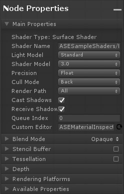

  <h2 class="c16" id="h.7qa76b8ic1ww">光照模型</h2>
  
定义表面如何反射光，通常称为所使用的着色器类型。 ASE目前提供标准（金属 Standard（Metallic））、标准镜面（Standard Specular）、Lambert和Blinn Phong。

  <h2 class="c7" id="h.aeqrodfrjgob">Lamber</h2>
  

  

  

  

  <h2 class="c7" id="h.lkgxorsaa626">标准镜面（Standard Specular）</h2>
  
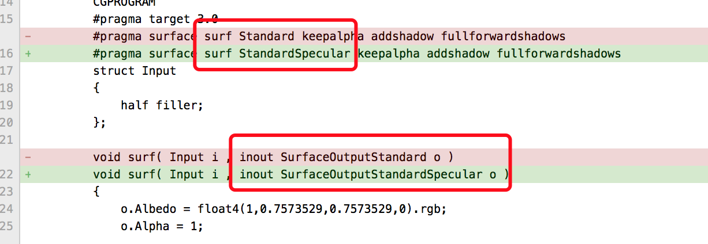

  

  

  <h2 class="c7" id="h.alr2tfnn7z0r">Blinn Phong</h2>
  
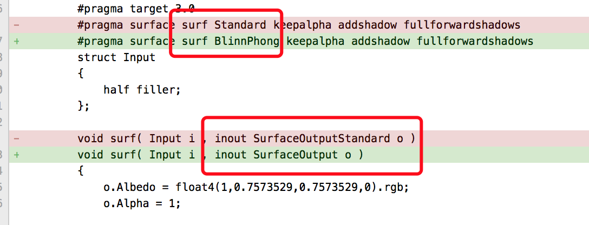

  

  

  <h2 class="c7" id="h.3qsr502gynpm">Unlit (无光源)</h2>
  
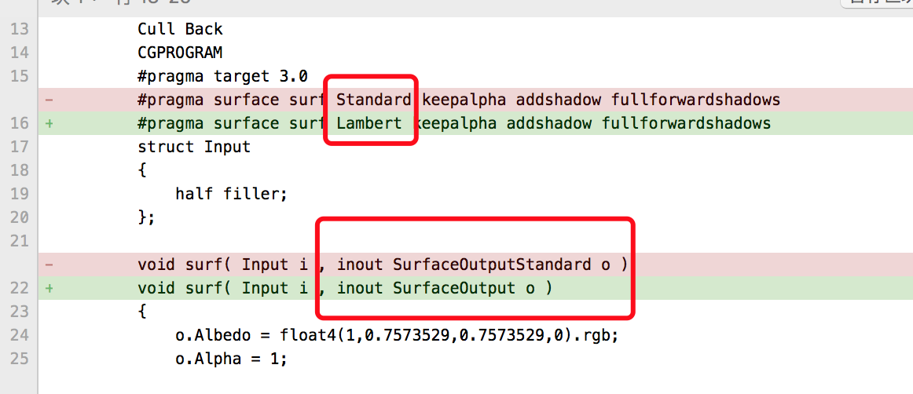

  

  

  

  <h2 class="c7" id="h.z42fufynjpm1">自定义光照</h2>
  
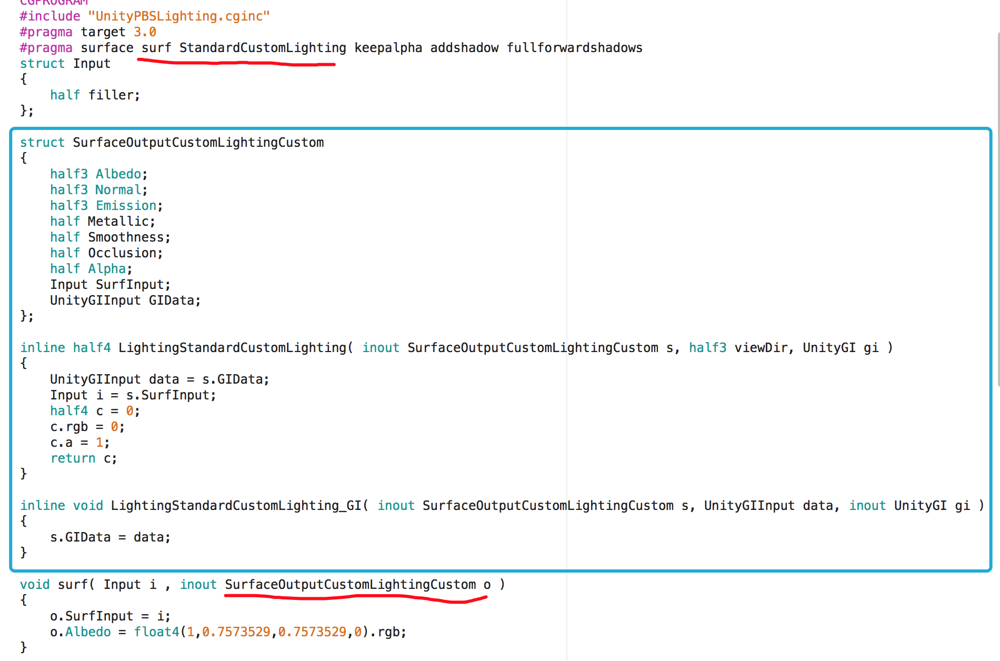

  

  <h2 class="c16 c19" id="h.hvcopliioe1f"></h2>
  <h2 class="c16" id="h.3je57opqhywk">查看Unity内置光照模型源码</h2>
  <ol class="c4 lst-kix_d53mlxx680aj-0 start" start="1">
   <li class="c5">去官网下载 对应版本的 内置着色器</li>
   <li class="c5">解压将怎个文件夹拖到Sublime Text</li>
   <li class="c5">搜索文件 </li>
  </ol>
  

  
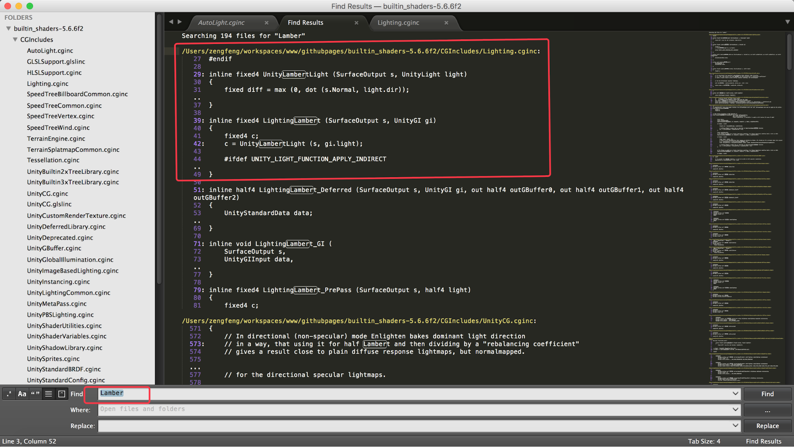

  

  

  

  <h2 class="c16 c19" id="h.b4yxzu8e90tx"></h2>
  <h1 class="c11" id="h.fs903zeuo58s">着色器模型（Shader Model）</h1>
  <h1 class="c11" id="h.eke219kzz90c">当编写表面着色器或常规着色器程序时，HLSL源可以编译成不同的“着色器模型”。更高的着色器编译目标允许使用更多的现代GPU功能，但可能使得着色器不能在较旧的GPU或平台上工作。</h1>
  <h1 class="c11" id="h.tj5vshtb8rzm">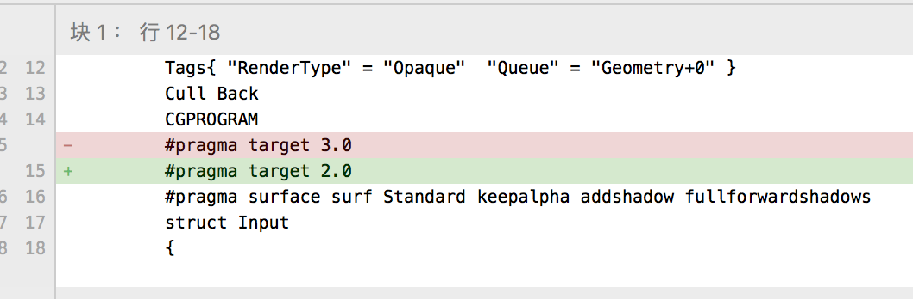</h1>
  

  
精度（Precision）

  

  
定义内部计算的精度，使用较低类型提供了额外的性能提升以换取一些精度。默认设置为Float。

  

  
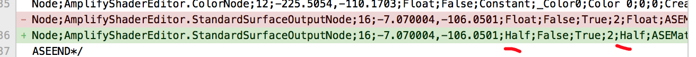

  

  

  

  
剔除模式（Cull Mode）

  
Front – 剔除前向几何体，Back – 剔除后向几何体，关闭 - 禁用剔除（双面材料）。默认情况下设置为Back。

  

  
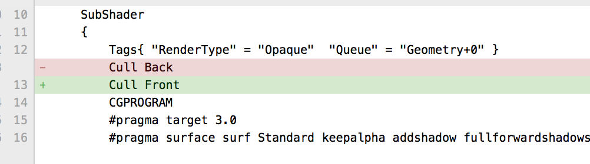

  

  

  
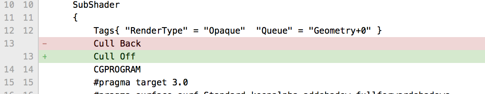

  

  

  

  
渲染路径（Render Path）

  

  
允许您定义着色器支持哪种模式（提前Forward / 延时Deferred）。默认设置为全部。

  

  
Forward Only:

  

  
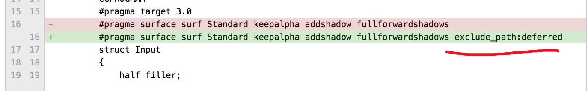

  

  
Deferred Only:

  

  

  

  
投射阴影（Cast Shadows）

  

  
定义使用着色器的对象是否投射阴影。

  
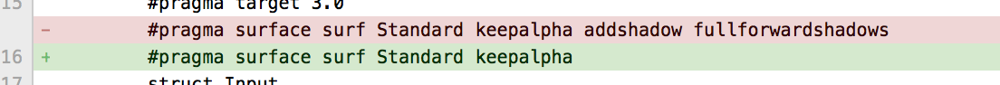

  

  

  
接收阴影（Receive Shadows）

  

  
定义使用着色器的对象是否接收阴影，这包括自阴影（只有使用正向渲染）。

  
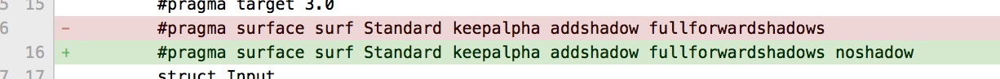

  

  

  

  
队列索引（Queue Index）

  

  
渲染队列偏移值，接受正（较晚）和负（较早）整数。

  

  
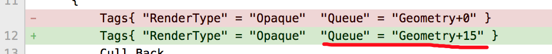

  

  

  
LOD

  
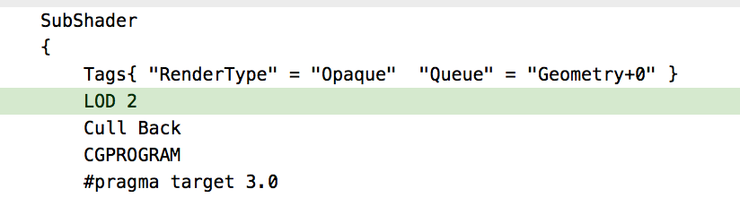

  

  

  <h1 class="c11" id="h.69cuwupucu8k">2. 混合模式（Blend Mode）</h1>
  

  

  

  

  

  <h3 class="c10" id="h.ruhszks3w5ox">混合模式（Blend Mode）：</h3>
  
所选模式自动调整可用参数;不透明（Opaque），遮罩（Masked），透明（Transparent），Alpha预乘（Alpha &nbsp;Transparent）或自定义（Custom）。

  

  <h4 class="c13" id="h.9cjc0qpkaesw">不透明（Opaque）</h4>
  
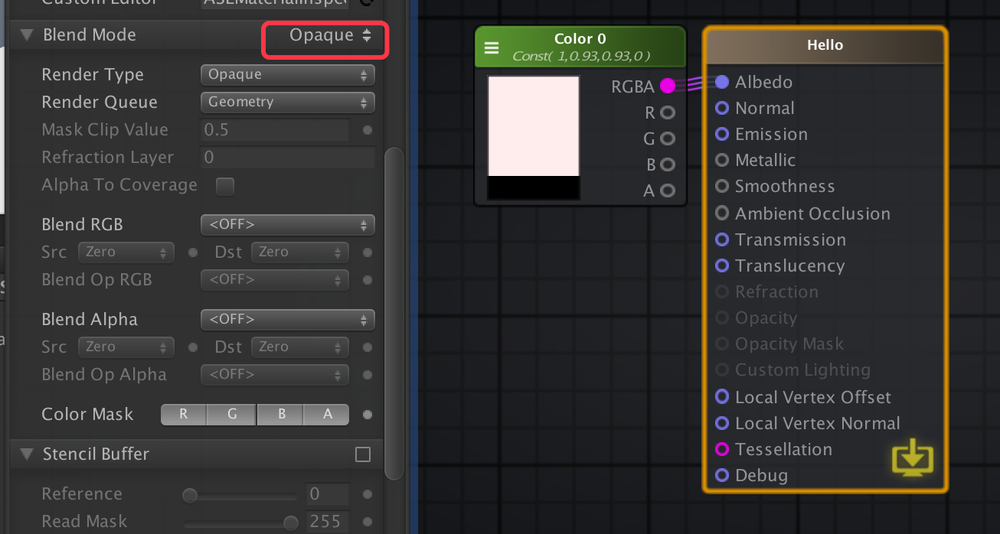

  

  <h4 class="c13" id="h.frhaivzenmvg">遮罩（Masked）</h4>
  
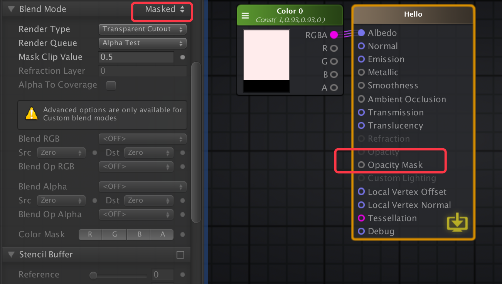

  
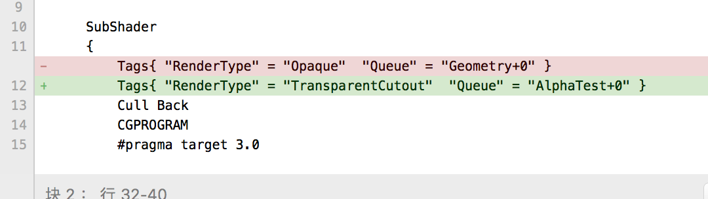

  

  <h4 class="c13" id="h.ir6g9akof1tw">透明（Transparent）</h4>
  

  

  

  

  

  

  
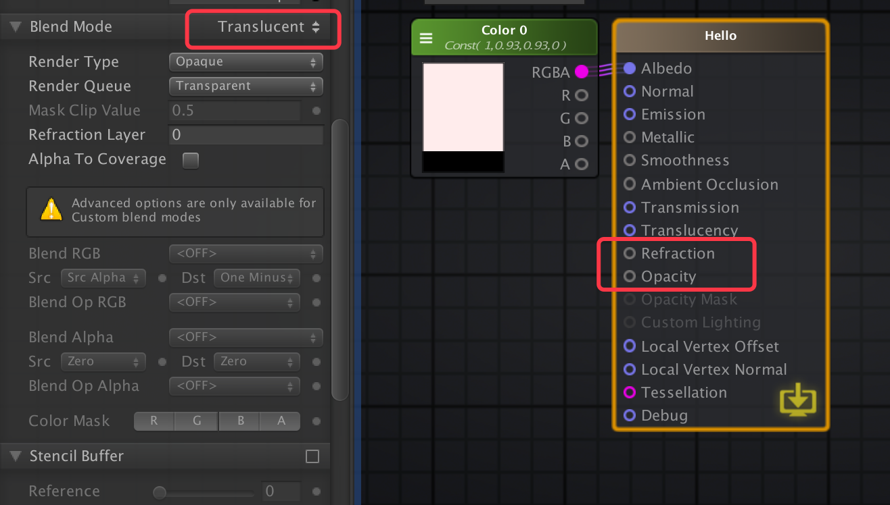

  
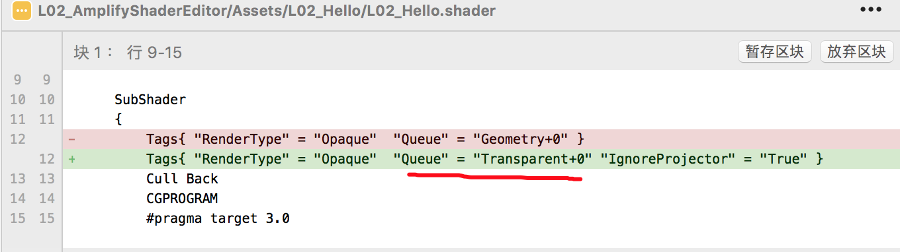

  

  <h4 class="c13" id="h.uaeembwtkner">Alpha预乘（Alpha &nbsp;Transparent）</h4>
  
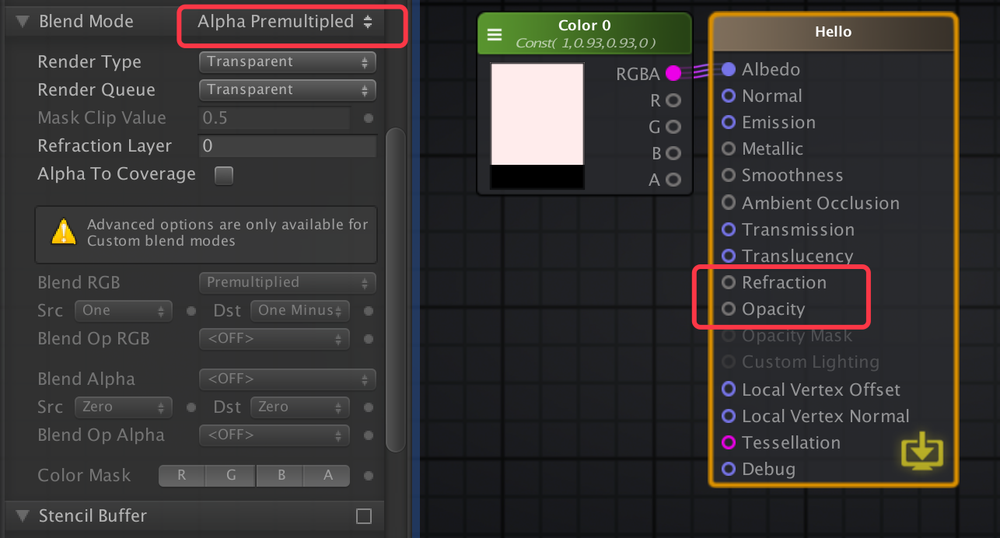

  
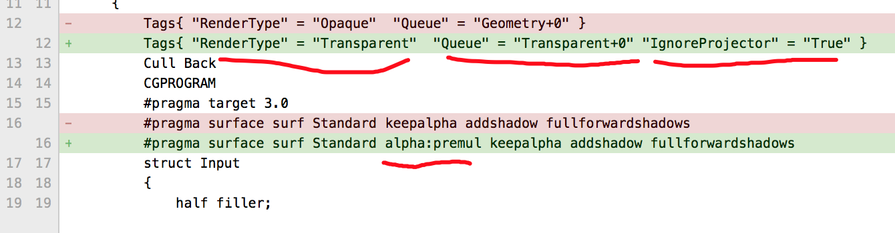

  

  

  

  

  

  

  

  <h3 class="c10" id="h.yco9d770ggv4">渲染类型（Render Type）：</h3>
  
该标记将着色器分为几个预定义组。可用标签：不透明（Opaque），透明（Transparent），透明抠出（Transparent Cutout），背景（Background），覆盖（Overlay），不透明树（Tree Opaque），透明树剪出（Tree Transparent Cutout），布告板树（Tree Billboard），草和布告板草皮（Grass and Grass Billboard）。

  

  <h3 class="c10" id="h.qrh7u9739k60">渲染队列（Render Queue）：</h3>
  
为了获得最佳性能，通过几何体渲染队列排布，从而优化对象的绘制顺序。所有其他渲染队列按距离对对象进行排序，从最远的那些开始渲染，并以最接近的结束。可用选项有背景、几何、Alpha测试、透明和覆盖。

  

  <h3 class="c10" id="h.lfrw3qxtk6vy">掩码片段值（Mask Clip Value）：</h3>
  
要与不透明度alpha比较的默认值。 0完全不透明，1完全掩蔽。默认设置为0，常用于透明抠出（Transparent Cutout）材质。

  

  <h3 class="c10" id="h.o6xoleoxm3iq">混合RGB和混合Alpha（Blend RGB and Blend Alpha）：</h3>
  
当渲染图形时，在所有着色器执行并且所有纹理都应用后，像素被写入屏幕。它们如何与已经存在的内容组合由Blend命令控制。 ASE目前提供定制、Alpha混合（Alpha Blend）、预乘（Premultiplied）、加法（Additive）、软加法（Soft Additive）、乘法（Multiplicative）和2x乘法（2x Multiplicative）模式。

  

  

  

  <h4 class="c13" id="h.hjop1yxmzex6">Alpha混合（Alpha Blend）</h4>
  
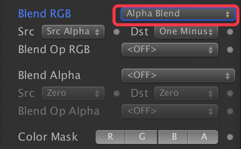

  
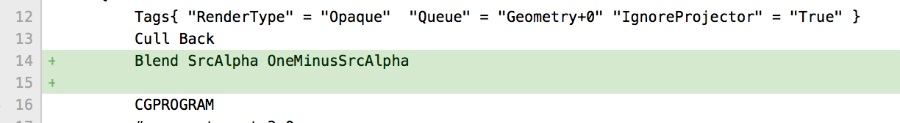

  

  

  <h4 class="c13" id="h.a3xxa9gy038e">预乘（Premultiplied）</h4>
  

  
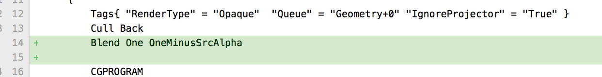

  

  <h4 class="c13" id="h.rloeuk676gb1">加法（Additive）</h4>
  
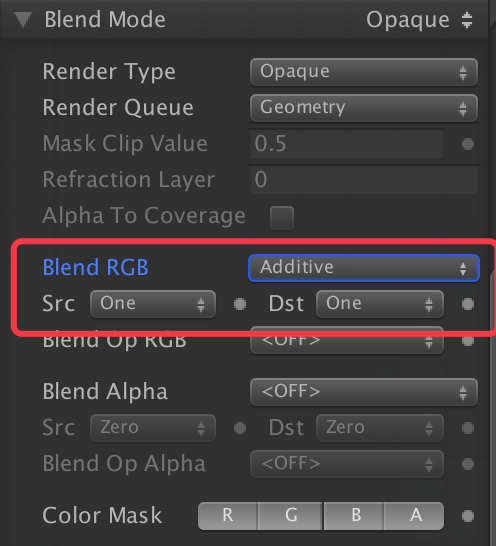

  
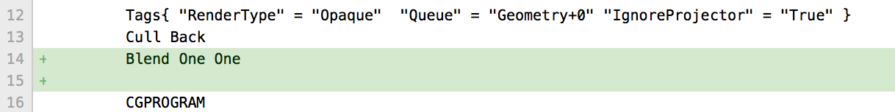

  

  

  

  <h4 class="c13" id="h.s4xysu8gq24">软加法（Soft Additive）</h4>
  

  
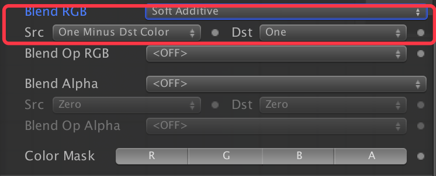

  
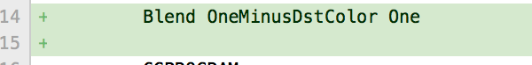

  

  <h4 class="c13" id="h.l1kie1afm7xc">乘法（Multiplicative）</h4>
  
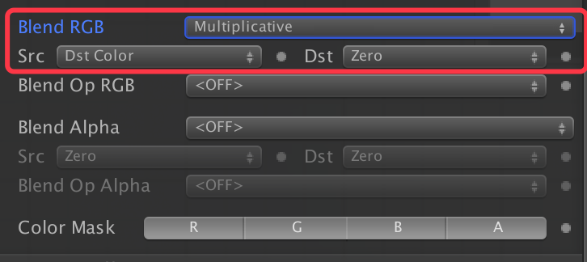

  

  

  <h4 class="c13" id="h.ujgpj9h5fhpd">2x乘法（2x Multiplicative）</h4>
  

  
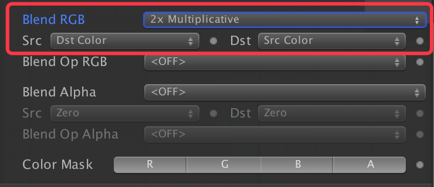

  

  
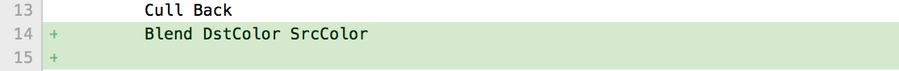

  

  <h4 class="c13" id="h.oonlti3mamth">粒子叠加 （Particle Additive）</h4>
  
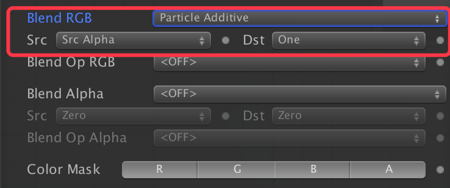

  
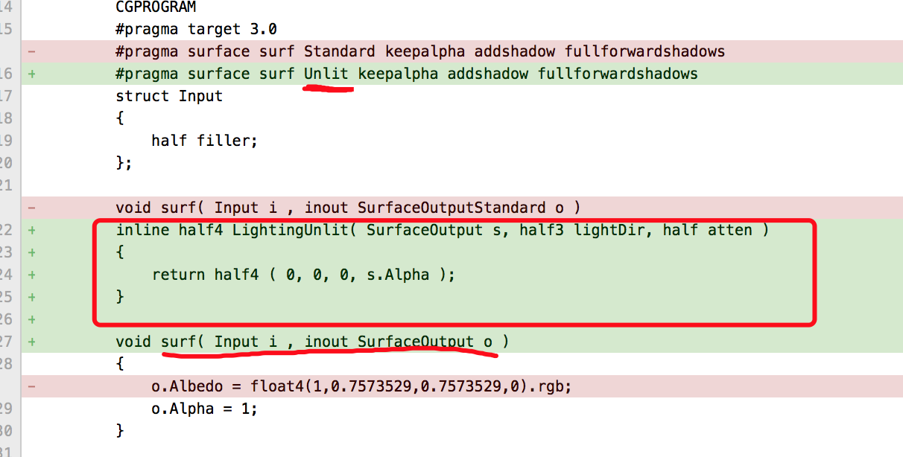

  

  

  <h4 class="c13" id="h.wbee2lx5abwp">混合因子（Blend Factor）（SrcFactor ＆ DstFactor）：</h4>
  
以下所有属性都适用于混合命令中的SrcFactor＆DstFactor。源指的是计算的颜色，目标是已经在屏幕上的颜色。如果BlendOp使用逻辑运算，则忽略混合因子。

  

  
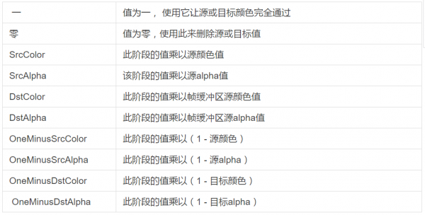

  

  

  

  <h3 class="c10" id="h.v0xu9gjzgwl8">混合操作RGB和混合操作Alpha（Blend Op RGB &amp; Blend Op Alpha）：</h3>
  
添加（Add）、子（Sub）、修改子（Rev Sub）、最小（Min）和最大（Max）。

  

  
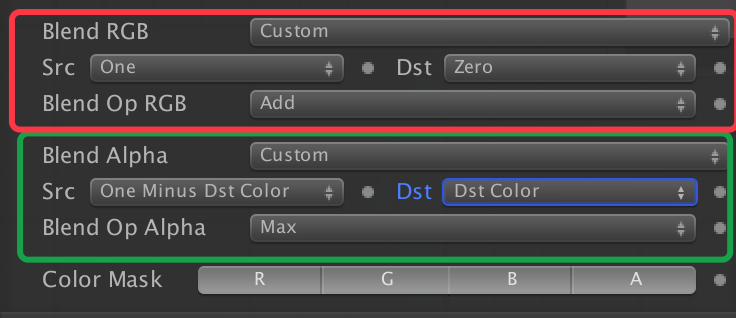

  
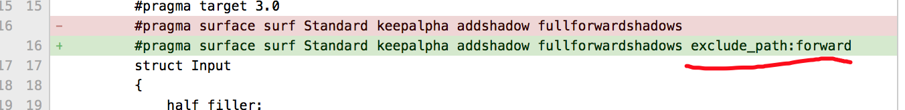

  

  <h3 class="c10" id="h.8ndyhgxc162">颜色蒙版（Color Mask）：</h3>
  
设置颜色通道写入蒙版，将其全部关闭使其不可见。

  

  

  

  

  <h1 class="c11" id="h.69s45ybbhq26">3.模板缓冲（Stencil Buffer）</h1>
  

  
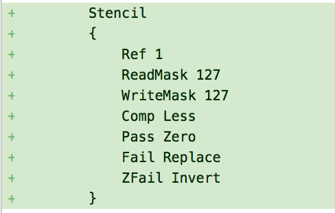

  

  

  

  
模板缓冲器可以用作每像素掩模的通用目的，用于保存或丢弃像素。它通常是每个像素8位整数。该值可以写入、递增或递减。 后续绘制调用可以根据该值进行测试，以决定是否应该在运行像素着色器之前丢弃该像素。

  

  
参考（Reference）：要比较的值和/或要写入缓冲区的值（如果Pass，Fail或ZFail设置为替换）。范围是0-255整数。

  

  
读取掩码（Read Mask）：作为0-255整数的8位掩码，用于将参考值与缓冲区（referenceValue＆readMask），比较方法comparisonFunction（stencilBufferValue＆readMask）的内容进行比较。默认值是255。

  

  
写掩码（Write Mask）：8位掩码，作为0-255整数，写入缓冲区时使用。默认值是255。

  

  
比较（Comparison）：用于将参考值与缓冲区的当前内容进行比较的函数。默认值是always。

  

  
通过（Pass）：如果模板测试（和深度测试）通过，对缓冲区的内容做什么。默认值是keep。

  

  
失败（Fail）：如果模板测试失败，对缓冲区的内容做什么。默认值是keep。

  

  
ZFail（ZFail）：如果模板测试通过，则缓冲区的内容如何处理，但深度测试失败。默认值是keep。

  

  

  <h1 class="c11" id="h.cm29mt2luaqm">4. 曲面细分（Tessellation）</h1>
  

  

  

  
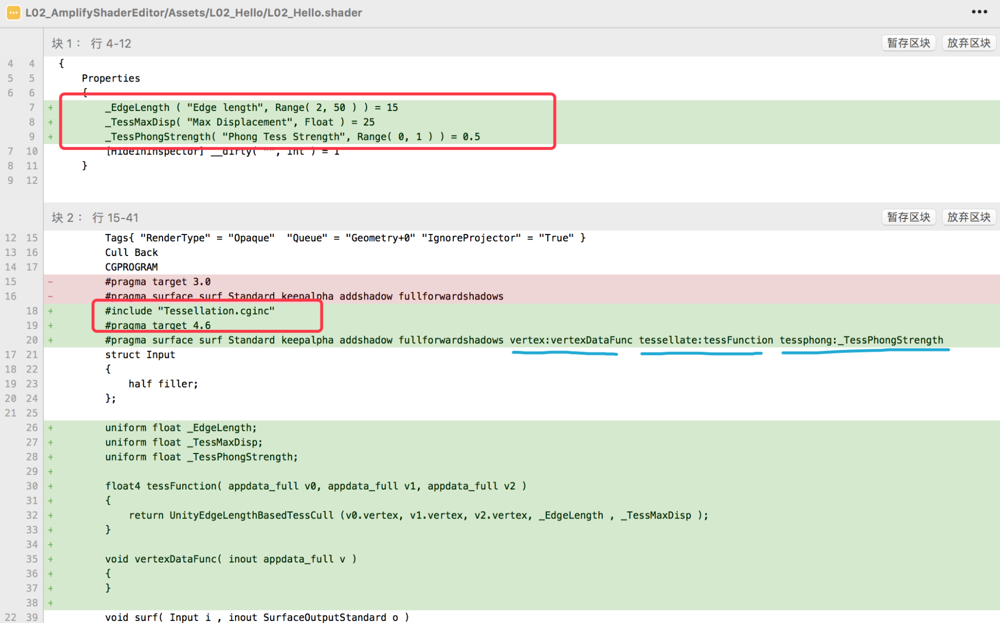

  

  

  
冯氏曲面细分（Phong）：修改细分面的位置，使得生成的面稍微跟随网格法线，默认设置为OFF。

  

  
类型（Type）：定义所使用的技术，基于距离、固定、边长和边长Cull。

  

  
曲面细分因子（Tess）：范围是1-32。

  

  
最小值（Min）：最小细分距离。

  

  
最大值（Max）：最大细分距离。

  

  

  <h1 class="c11" id="h.sv0lpf5wcy8y">5. 深度（Depth）</h1>
  
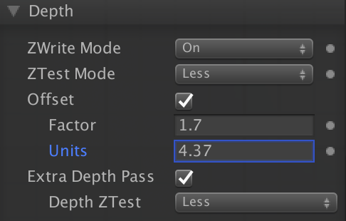

  

  

  

  

  
ZWrite模式（ZWrite Mode）：控制来自此对象的像素是否写入深度缓冲区（默认为开）。如果你画的是实体对象，请保持此状态。如果您绘制半透明效果，请切换到ZWrite Off。

  

  
ZTest模式（ZTest Mode）：如何进行深度测试。默认值为LEqual（将对象从现有对象或远距离绘制为现有对象;隐藏其后面的对象）。 ASE提供ZTest 小于（Less）、大于（Greater）、小于等于（LEqual）、大于等于（GEqual）、等于（Equal）、不等于（NotEqual）和通常（Always）。

  

  
偏移（Offset）：允许您使用两个参数指定深度偏移 — 因子和单位。因子相对于多边形的X或Y缩放最大Z斜率，单位缩放最小可分辨深度缓冲区值。这允许您强制一个多边形绘制在另一个顶部，虽然它们实际上在相同的位置。例如，偏移（0，-1）拉动多边形更接近相机忽略多边形的斜率，而偏移（-1，-1）将拉近多边形，看看掠角。

  

  
因子（Factor）：相对于多边形的X或Y，缩放最大Z斜率。

  

  
单位（Units）：单位缩放最小可分辨深度缓冲区值。

  

  

  <h1 class="c11" id="h.adhkeliftpgz">渲染选项</h1>
  
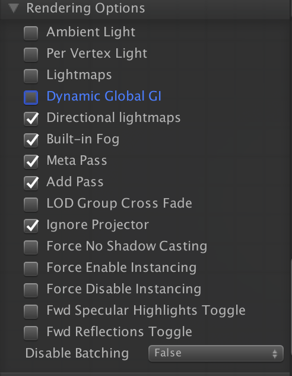

  
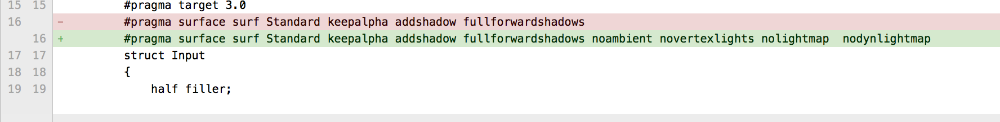

  

  

  <h1 class="c11" id="h.sllmxy1xka3z">6. 渲染平台（Rendering Platforms）</h1>
  
定义支持哪些平台， 默认设置为全部。

  

  
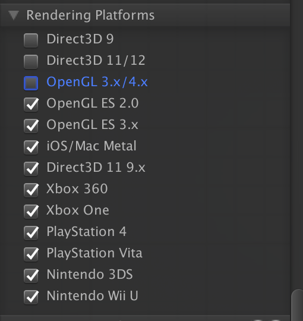

  

  

  

  
7. 可用属性（Available Properties）

  
设置为属性（Property）的变量将在此部分中列出，您可以通过拖动它们来调整它们的位置。

  

  
&nbsp;

