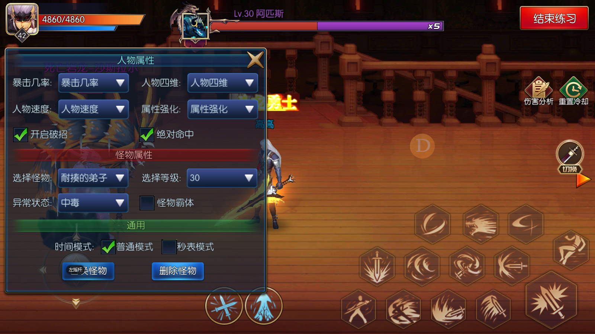

---

layout: post
title: 阿拉德之怒
date: 2020-05-13 13:51:00
categories: 工具
tags: 阿拉德之怒
excerpt: 阿拉德之怒
shareexcerpt: 阿拉德之怒 
thread: 2017022112510000
author: 大海明月
authorQQ: 593705098
authorEmail: zengfeng75@qq.com
thumbnail:

sh: true
sh_csharp: true
sh_cpp: true
---

## 阿拉德之怒

| K                | W                        | H                  | L                     |
| ---------------- | ------------------------ | ------------------ | --------------------- |
| What do I know？ | What do I want to know？ | How I will learn？ | What I have learned？ |
| 我知道些什么？   | 我想要知道些什么？       | 我该如何去学习？   | 我学到了什么？        |
| Know             | Want                     | How                | Learned               |
|              |                      |                 |                |
| 职业 | 职业有哪些？ | 游戏里拔 |                |
| 技能 | 每种职业的区别？ | 群里问 |                |
| 装备 | 技能有什么类型？ | 网上看视频 |                |
| 武器 | 装备有哪些？ |                 |                |
| 时装 | 每种装备加什么属性？ |                 |                |
| 属性 | 时装有哪些？ |                 |                |
|              | 时装加什么属性？ |                 |                |
|              | 属性有哪些？分别起什么作用？ |                 |                |
|              | 属性分类？ |                 |                |
|              | 游戏玩法有哪些？ |                 |                |
|              | 单人玩法有哪些？ |                 |                |
|              | 多人组队玩法有哪些？ |                 |                |
|              | PVP玩法有哪些？ |                 |                |
|              | 活动地图有哪些？怎么玩？ |                 |                |
|              | 主要的养成有哪些？ |                 |                |
|              | 材料有哪些？分别做什么？ |                 |                |
|              | 消耗品有哪些？分别什么作用？ |                 |                |
|              | 货币有哪些？什么区别？ |                 |                |
|              | 经济循环？ |                 |                |
|              | 整体模块划分？ |                 |                |
|              |  |                 |                |
|              |  |                 |                |

## 目录

[TOC]

## 属性

[【腾讯文档】阿拉德之怒--属性]: https://docs.qq.com/sheet/DVXpvQXRwUWZHZXl6?c=C1A0A0

| 名称                | 作用                                                         |      |      |        |                                     |
| ------------------- | ------------------------------------------------------------ | ---- | ---- | ------ | ----------------------------------- |
| 生命                | 生命值减为0时，角色死亡；                                    | 血量 |      |        | 当前血量                            |
| 魔力                | 角色使用技能将会消耗一定量的魔力值；                         | 技能 |      |        | 当前蓝量                            |
| 力量                | 影响角色的物理攻击力和固定值技能、中毒、出血、灼伤、感电的伤害； | 物理 |      |        | 物理攻击力                          |
| 智力                | 影响角色的魔法攻击力和固定值技能、中毒、出血、灼伤、感电的伤害； | 魔法 |      |        | 魔法攻击力，固定值技能              |
| 体力                | 影响角色的生命最大值、生命恢复量和物理防御力；               | 物理 |      |        | 血量最大值，血量恢复量， 物理防御力 |
| 精神                | 影响角色的魔力最大值、魔力恢复量和魔法防御力；               | 魔法 |      |        | 蓝量最大值，蓝量恢复量， 魔法防御力 |
| 物理攻击            | 对0防御的对象造成伤害，并造成无视防御的追加伤害；            | 物理 |      |        |                                     |
| 魔法攻击            | 对0防御的对象造成伤害，并造成无视防御的追加伤害；            | 魔法 |      |        |                                     |
| 固定攻击            | 独立于物理攻击、魔法攻击之外的攻击，增加技能面板中的固定伤害 |      |      |        |                                     |
| 物理防御            | 被相同lv的对象攻击时，减少受到的伤害，物理防御提升后，将减少中毒、出血、灼伤、感电的伤害； | 物理 |      |        |                                     |
| 魔法防御            | 被相同lv的对象攻击时，减少受到的伤害，魔法防御提升后，将减少中毒、出血、灼伤、感电的伤害； | 魔法 |      |        |                                     |
| 物暴                | 提升物理攻击造成额外伤害的概率；                             | 物理 | 概率 |        |                                     |
| 魔暴                | 提升魔法攻击造成额外伤害的概率；                             | 魔法 | 概率 |        |                                     |
| 攻速                | 影响玩家物理攻击的出手速度；                                 | 物理 |      | 百分比 |                                     |
| 施法速度            | 影响玩家施放魔法的施放时间；                                 | 技能 |      | 百分比 |                                     |
| 移速                | 影响玩家移动速度                                             |      |      | 百分比 |                                     |
| 命中                | 额外提升角色攻击时的成功几率；                               |      | 概率 |        |                                     |
| 闪避                | 额外提升角色攻击时的躲避几率；                               |      | 概率 |        |                                     |
| 生命恢复量          | 每分钟恢复的血量；                                           | 血量 |      |        | 血量恢复                            |
| 魔力恢复量          | 每分钟恢复的魔力；                                           | 技能 |      |        | 蓝量恢复                            |
| 僵直                | 增加敌人受击后无法动弹的时间                                 |      |      |        |                                     |
| 硬直                | 提升后，可以减少自身被攻击后无法动弹的时间                   |      |      |        |                                     |
| 侵蚀抗性            | 英雄角色在虚空地下城和混沌地下城中的伤害和生命最大值         |      |      |        |                                     |
| 武器属性攻击        | 当技能没有属性攻击，武器属性攻击会决定技能的属性攻击         |      |      |        |                                     |
| 光/火/冰/暗属性强化 | 增加光/火/冰/暗属性攻击的伤害；                              |      |      |        |                                     |
| 光/火/冰/暗属性抗性 | 减少受到的光/火/冰/暗属性攻击伤害。                          |      |      |        |                                     |

## 装备

- 肩部
- 胸部
- 腰部
- 腿部
- 鞋子

- 武器 （外显）

- 戒指

- 项链

- 手镯

- 称号 （外显）

  

## 时装

|                   |      |
| ----------------- | ---- |
| 头部              | 外显 |
| 衣服              | 外显 |
| 头饰              |      |
| 首饰              |      |
| 裤子              | 外显 |
|                   |      |
| 武器              |      |
| 翅膀              |      |
| 光环 （脚底光圈） |      |

## 技能

- 主要靠角色升级，开放技能，和升级技能加点
- 技能解锁条件：角色等级、完成任务
- 武器会对耗蓝和CD产生影响

### 技能分类

- 初始技能：被动技能，不用升级，直接为最高等级
- 状态技能（Buff技能）：不能手动配置，会默认配置好
- 主动技能

### 技能标签

- 辅助
- 防御
- 物理
- 魔法
- 近战
- 远程
- 起手
- 连招
- 抓取
- 跑位
- 输出

### 技能分析

#### 条件

- 对应武器效果

#### 表现

- 动作表现
- 位移表现
- 自己前提条件
- 给与其他地方的前提条件
- 再次点击施放二段
- 浮空挑
- 高高跃起跳向敌人
- 将敌人击飞
- 人物落下
- 震地
- 多段伤害
- 跳跃到空中，再次点击按钮，可向下方发出
- 落地后出血冲击波
- 用武器将敌人挑飞到空中，然后下劈将先接触的1名敌人抓取，对抓取住的敌人造成范围多段伤害
- 招架，受到来自前方的攻击时，可以减少自身受到的攻击伤害，且无法被正面浮空或者击倒，但背面受到攻击时招架状态会被打断

#### 效果

- 无敌
- 霸体
- 僵直
- 浮空
- 击倒
- 击飞
- 眩晕
- 混乱
- 抓取
- 招架
- 打断
- 出血
- 灼伤
- 冰冻
- 加属性
- 叠加次数

- 起身瞬间无敌
- 蹲伏最大无敌
- 起身霸体时间
- 物理攻击力
- 攻击力
- 浮空力
- 2段浮空挑击攻击力
- 2段浮空挑击浮空力
- 斩击攻击力
- 出血几率
- 出血等级
- 出血时间
- 出血总伤害
- 下压物理攻击力
- 冲击波攻击力
- 冲击波伤害范围
- 上斩魔法攻击力
- 下斩魔法攻击力
- 裂波魔法攻击力
- 物理减伤率
- 魔法减伤率
- 【招架】旋风触发概率
- 旋风物理功
- 旋风眩晕概率
- 眩晕等级
- 眩晕持续时间

### 初始技能

| 图标和名称                                                   | 标签             | 类型 | 冷却（秒） | 耗魔 | 技能介绍                                                     | 技能效果                                                     |
| ------------------------------------------------------------ | ---------------- | ---- | ---------- | ---- | ------------------------------------------------------------ | ------------------------------------------------------------ |
|  | 物理，近战       | 被动 | 0          | 0    | 快速闪身后撤，躲避敌人攻击                                   | 起跳瞬间无敌0.15秒                                           |
|  | 防御             | 被动 | 5          | 0    | 在倒地状态下按住攻击按钮不放开，人物会进行起身蹲伏，放开按键会进入起身状态，达到最打蹲伏时间后也会进入起身状态；在起身蹲伏时，自身是无敌的 | 蹲伏最大无敌：3秒 起身霸体时间：0.2秒                   |
|  | 物理，近战，跑位 | 被动 | 0          | 0    | 在双击跑动的状态中点击攻击按钮，向前滑行用脚进行攻击敌人，只有在系统设置中开启双击跑动才能使用 | 物理攻击里：100%                                             |
|  | 物理，近战       | 被动 | 1          | 5    | 在双击跑动的状态中点击攻击按钮，使用武器向前滑行进行攻击敌人，只有在系统设置中开启双击跑动才能使用 | 物理攻击里：120%                                             |
|  | 辅助             | 被动 | 0          | 0    | 飞影的防具会沾染自身的剑道气息，每装备一件轻甲都会获得额外的力量、体力、精神、生命、魔力、魔力恢复、硬直的加成 | 增加力量、体力、精神、生命、魔力：受装备品质和等级影响 增加魔力恢复、硬直：不受装备品质和等级影响 |
|  |                  | 被动 | 0          | 0    | 只有习得此技能时，才可以穿戴光刃武器                         |                                                              |

## 职业

#### 职业类型

- 战士 （男）: 剑术出神入化，善用刀剑类武器攻击敌人
  - 飞影: 物理攻击、攻速
  - 弑神：力量、攻速
  - 明王：智力、施法速度
  - 阵魔： 魔法攻击、施法速度
- 枪手 （男）： 枪法精悍，善于利用机械远程距离攻击袭击敌人
- 枪手 （女）： 不可思议的爆发力， 连击能力更胜男枪手
- 武术师 （女）： 自然界中无处不在的念，念是万物
- 神谕者 （男）：手中的巨兵赋予了他们超凡的攻击力和打击范围
- 法师 （女）： 可灵活运用自然界的冰、火、光、暗元素施展魔法
- 牧师
- 潜行者

#### 职业影响

- 技能：这是职业最大的区别
- 武器
- 时装

#### 战士 （男）: 剑术出神入化，善用刀剑类武器攻击敌人

​	

#### 枪手 （男）： 枪法精悍，善于利用机械远程距离攻击袭击敌人

#### 枪手 （女）： 不可思议的爆发力， 连击能力更胜男枪手

#### 武术师 （女）： 自然界中无处不在的念，念是万物

#### 神谕者 （男）：手中的巨兵赋予了他们超凡的攻击力和打击范围

#### 法师 （女）： 可灵活运用自然界的冰、火、光、暗元素施展魔法

## 玩法

- 主线副本

- 日常限次玩法

- 日常限时玩法

- 秘境

- 决斗

- 深渊

- 公会活动

  

### 主线副本

### 日常限次玩法

- 限制次数
- 获取大量经验或者绑定金币，特殊材料
- 国际斗牛节、哥布林宝藏室：和主线副本一样，只是掉落的东西比较多和特殊
- 勇者之塔：爬塔玩法，看数值和操作

##### 国际斗牛节 和 哥布林宝藏室

##### 勇者之塔

##### 堕落之塔

### 日常限时玩法

##### 怪物攻城 (组队玩法)

- 整点会在地图中刷怪
- 需要组队才能玩，一个人的队伍也可以

一个人的队伍也可以打

##### 神秘商店

##### 荣耀战场 （吃鸡模式）

### 公会活动

#### 公会领地战

- 城市雕像： 占领天空之城的公会的会长、副会长

#### 公会跨服领地 （跨服公会战）

前往：秘籍的地图

### 秘境 (可组队)

- 可以组队完

- 单人可以携带药品使用，组队药品无效

- 普通关卡一样的玩法，主要是掉落高级物品，限制次数，需要消耗品等

  | 名称       | 消耗           | 掉落                                                 | 难度影响               |
  | ---------- | -------------- | ---------------------------------------------------- | ---------------------- |
  | 深渊地下城 | 精力值，深渊票 | 橙色装备，紫色装备，宇宙之眼材料，混沌之匙           | 影响掉落经验和物品加成 |
  | 远古地下城 | 精力值，远古票 | 粉色装备，深渊票，远古票，万世王者称号，帝王文章称号 | 影响掉落经验和物品加成 |
  | 混沌地下城 | 混沌之匙       | 虚无之源                                             |                        |
  |            |                |                                                      |                        |

  

##### 深渊地下城

- 消耗：精力值，深渊票
- 掉落：主要橙色装备、部分紫色装备
- 难度：影响掉落经验和物品加成

<iframe src="http://open.iqiyi.com/developer/player_js/coopPlayerIndex.html?vid=0d3b55f25abed03bf6edad4ac8930274&tvId=9686044309&accessToken=2.f22860a2479ad60d8da7697274de9346&appKey=3955c3425820435e86d0f4cdfe56f5e7&appId=1368&height=100%&width=100%" frameborder="0" allowfullscreen="true" width="100%" height="100%"></iframe>

##### 深渊商店

##### 远古地下城

有个神秘剑客一起帮打

##### 传奇之路 （材料兑换称号商店）

##### 混沌地下城

##### 团队地下城

### 决斗PVP

##### 自由练习

- 练习不同的招式、连招等可以获得奖励。

##### 1v1天梯

- 主要该玩法来排段位，排行榜

##### 1v1 段位奖励

- 7个段位
- 段位可以属性加成

##### 1v1 段位排行榜

##### 录像

##### 多人对战

* 3V3娱乐模式，没有惩罚和奖励，车轮战，1对1，可以调整出场顺序
* 2v2乱斗模式，所有人同时参战，不计算段位积分

### 组队PVE

## 公会

- 会长 1个
  - 副会长 2个
    - 普通
    - 精英 （在公会连续7天）

#### 建筑

##### 公会商店

#### 福利

##### 公会仓库

##### 公会红包

