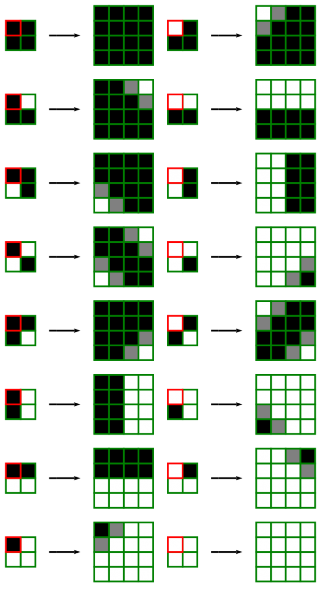
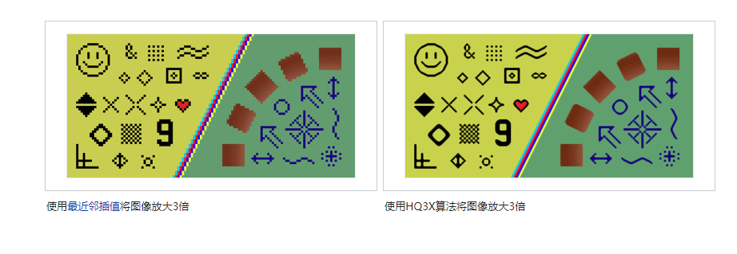

---

layout: post
title: 【笔记】 图像技术-缩放图片
date: 2020-12-14 13:51:00
categories: 游戏技术
tags: 游戏技术
excerpt: 图像技术-缩放图片
shareexcerpt: 图像技术-缩放图片
thread: 20201214205400
author: 大海明月
authorQQ: 593705098
authorEmail: zengfeng75@qq.com
thumbnail:

sh: true
sh_csharp: true
sh_cpp: true
---

# 相关文档

[《英雄联盟》战争迷雾 https://technology.riotgames.com/news/story-fog-and-war](https://technology.riotgames.com/news/story-fog-and-war)

[缩放图像技术 hqx]: https://en.wikipedia.org/wiki/Hqx

[缩放图像技术 hqx 滤镜代码和原理]: http://blog.pkh.me/p/19-butchering-hqx-scaling-filters.html

hqx有 hqx2、hqx3、hqx4 分别是放大2倍、3倍、4倍。

hq2x 放大2倍技术

[缩放图像技术论文 SIGGRAPH 2011]: http://johanneskopf.de/publications/pixelart/

[缩放图像技术 不同算法效果展示]: http://johanneskopf.de/publications/pixelart/supplementary/multi_comparison.html

