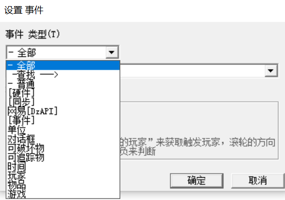
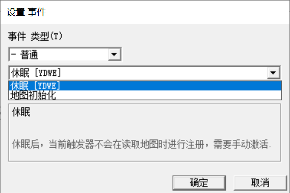
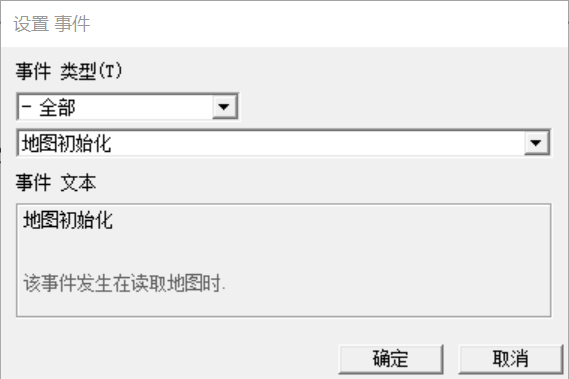
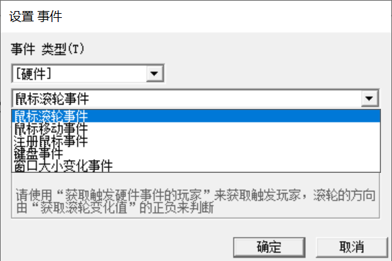
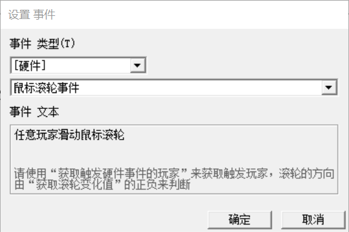
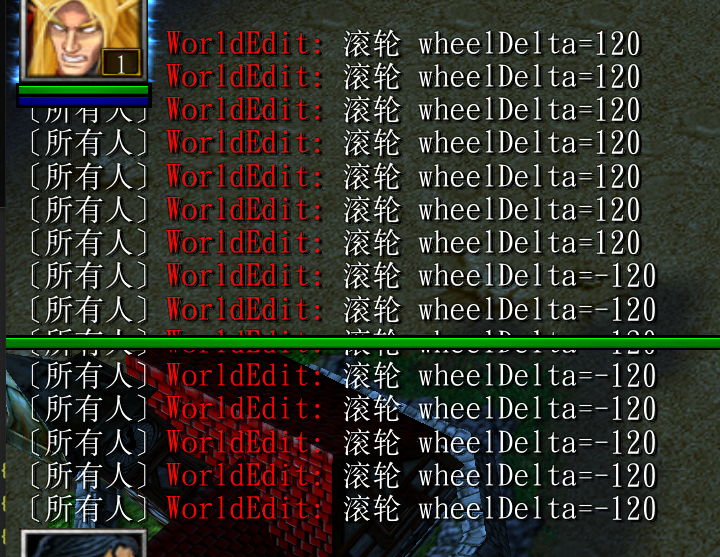

---


layout: post
title: War3 触发器
date: 2021-02-17 13:51:00
categories: war3
tags: War3 触发器 Trigger
excerpt: War3 触发器
shareexcerpt: War3 触发器
thread: 2021021712510000
author: 大海明月
authorQQ: 593705098
authorEmail: zengfeng75@qq.com
thumbnail:

sh: true
sh_csharp: true
sh_cpp: true
---


# 一：事件




## 1.1 事件 - 普通




### 1.1.1 事件 - 普通 - 地图初始话



PS: 在代码中其实就是每有加任何事件，直接触发

```java
function Trig_ZFLearn01TrigerActions takes nothing returns nothing
    call YDWEDisplayChat( Player(0), 0, "Hello World" )
endfunction

//===========================================================================
function InitTrig_ZFLearn01Triger takes nothing returns nothing
    set gg_trg_ZFLearn01Triger = CreateTrigger()
    call TriggerAddAction(gg_trg_ZFLearn01Triger, function Trig_ZFLearn01TrigerActions)
endfunction

```


## 1.2 事件 - 硬件




### 1.2.1 事件 - 硬件 - 鼠标滚轮事件



```
call DzTriggerRegisterMouseWheelEventTrg( gg_trg_ZFLearn01Triger )
```


```java
function Trig_ZFWheelTriggerActions takes nothing returns nothing
    // 获取滚轮delta
    local integer wheelDelta =  DzGetWheelDelta()
    call YDWEDisplayChat( Player(0), 0, "滚轮 wheelDelta=" + I2S(wheelDelta) )
endfunction

//===========================================================================
function InitTrig_ZFWheelTrigger takes nothing returns nothing
    set gg_trg_ZFLearn01Triger = CreateTrigger()
    // 鼠标滚轮事件
    call DzTriggerRegisterMouseWheelEventTrg( gg_trg_ZFLearn01Triger )
    call TriggerAddAction(gg_trg_ZFLearn01Triger, function Trig_ZFWheelTriggerActions)
endfunction


```


