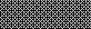
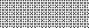
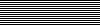
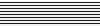
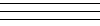
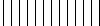

[ImageMagick - Convert, Edit, or Compose Digital Images](file:///D:/Program Files/ImageMagick-7.1.0-Q16-HDRI/index.html)

[ImageMagick - Download](file:///D:/Program Files/ImageMagick-7.1.0-Q16-HDRI/www/download.html#windows)

[ImageMagick/ImageMagick: 🧙‍♂️ ImageMagick 7 (github.com)](https://github.com/ImageMagick/ImageMagick)


![[ImageMagick Examples]](_img/2021-10-28-ImageMagick图片命令工具/examples.jpg)


```bash
## 缩放图片
magick 2.png -resize 50% 2_half.png

## 图片转换, png 转 jpg
magick 2.png 2_magick.jpg

## 图片转换, png 转 dds
magick 2.png 2_magick.dds

## 将序列图片 转 gif
magick *.jpg images.gif

## 将gif图片的帧提前出序列帧
magick 1.gif testgif/1_.png
```


## 图片变灰

[ImageMagick – Command-line Options](https://imagemagick.org/script/command-line-options.php#grayscale)

```
magick 2.png -grayscale Rec709Luminance 2_grayscale.png
magick 2.png -colorspace LinearGray 2_colorspace.png
magick 2.png -colorspace Gray 2_colorspace_gray.png
```


## 图案


[ImageMagick – Image Formats](https://imagemagick.org/script/formats.php#builtin-patterns)

```bash
## 生成棋盘格
magick -size 640x480 pattern:checkerboard checkerboard.png
```

## Built-in Patterns

ImageMagick includes a number of built-in (embedded) patterns which may be referenced as if they were an image file. The pattern: format tag may be used via the syntax pattern:name to request an embedded pattern (e.g. pattern:checkerboard). The pattern size is controlled with the [-size](https://imagemagick.org/script/command-line-options.php#size) command line option.

| Tag                  | Mode | Description                                            | Notes                                                        |
| -------------------- | ---- | ------------------------------------------------------ | ------------------------------------------------------------ |
| BRICKS               | R    | brick pattern, 16x16                                   |  |
| CHECKERBOARD         | R    | checkerboard pattern, 30x30                            |  |
| CIRCLES              | R    | circles pattern, 16x16                                 |  |
| CROSSHATCH           | R    | crosshatch pattern, 8x4                                |  |
| CROSSHATCH30         | R    | crosshatch pattern with lines at 30 degrees, 8x4       |  |
| CROSSHATCH45         | R    | crosshatch pattern with lines at 45 degrees, 8x4       |  |
| FISHSCALES           | R    | fish scales pattern, 16x8                              |  |
| GRAY0                | R    | 0% intensity gray, 32x32                               |   |
| GRAY5                | R    | 5% intensity gray, 32x32                               |   |
| GRAY10               | R    | 10% intensity gray, 32x32                              |  |
| GRAY15               | R    | 15% intensity gray, 32x32                              |  |
| GRAY20               | R    | 20% intensity gray, 32x32                              |  |
| GRAY25               | R    | 25% intensity gray, 32x32                              |  |
| GRAY30               | R    | 30% intensity gray, 32x32                              |  |
| GRAY35               | R    | 35% intensity gray, 32x32                              |  |
| GRAY40               | R    | 40% intensity gray, 32x32                              |  |
| GRAY45               | R    | 45% intensity gray, 32x32                              |  |
| GRAY50               | R    | 50% intensity gray, 32x32                              |  |
| GRAY55               | R    | 55% intensity gray, 32x32                              |  |
| GRAY60               | R    | 60% intensity gray, 32x32                              |  |
| GRAY65               | R    | 65% intensity gray, 32x32                              |  |
| GRAY70               | R    | 70% intensity gray, 32x32                              |  |
| GRAY75               | R    | 75% intensity gray, 32x32                              |  |
| GRAY80               | R    | 80% intensity gray, 32x32                              |  |
| GRAY85               | R    | 85% intensity gray, 32x32                              |  |
| GRAY90               | R    | 90% intensity gray, 32x32                              |  |
| GRAY95               | R    | 95% intensity gray, 32x32                              |  |
| GRAY100              | R    | 100% intensity gray, 32x32                             |  |
| HEXAGONS             | R    | hexagon pattern, 30x18                                 |  |
| HORIZONTAL           | R    | horizontal line pattern, 8x4                           |  |
| HORIZONTAL2          | R    | horizontal line pattern, 8x8                           |  |
| HORIZONTAL3          | R    | horizontal line pattern, 9x9                           |  |
| HORIZONTALSAW        | R    | horizontal saw-tooth pattern, 16x8                     |  |
| HS_BDIAGONAL         | R    | backward diagonal line pattern (45 degrees slope), 8x8 |  |
| HS_CROSS             | R    | cross line pattern, 8x8                                |  |
| HS_DIAGCROSS         | R    | diagonal line cross pattern (45 degrees slope), 8x8    |  |
| HS_FDIAGONAL         | R    | forward diagonal line pattern (45 degrees slope), 8x8  |  |
| HS_HORIZONTAL        | R    | horizontal line pattern, 8x8                           |  |
| HS_VERTICAL          | R    | vertical line pattern, 8x8                             |  |
| LEFT30               | R    | forward diagonal pattern (30 degrees slope), 8x4       |  |
| LEFT45               | R    | forward diagonal line pattern (45 degrees slope), 8x8  |  |
| LEFTSHINGLE          | R    | left shingle pattern, 24x24                            |  |
| OCTAGONS             | R    | octagons pattern, 16x16                                |  |
| RIGHT30              | R    | backward diagonal line pattern (30 degrees) 8x4        |  |
| RIGHT45              | R    | backward diagonal line pattern (30 degrees), 8x8       |  |
| RIGHTSHINGLE         | R    | right shingle pattern, 24x24                           |  |
| SMALLFISHSCALES      | R    | small fish scales pattern, 8x8                         |  |
| VERTICAL             | R    | vertical line pattern, 8x8                             |  |
| VERTICAL2            | R    | vertical line pattern, 8x8                             |  |
| VERTICAL3            | R    | vertical line pattern, 9x9                             |  |
| VERTICALBRICKS       | R    | vertical brick pattern, 16x16                          |  |
| VERTICALLEFTSHINGLE  | R    | vertical left shingle pattern, 24x24                   |  |
| VERTICALRIGHTSHINGLE | R    | vertical right shingle pattern, 24x24                  |  |
| VERTICALSAW          | R    | vertical saw-tooth pattern, 8x16                       |  |

