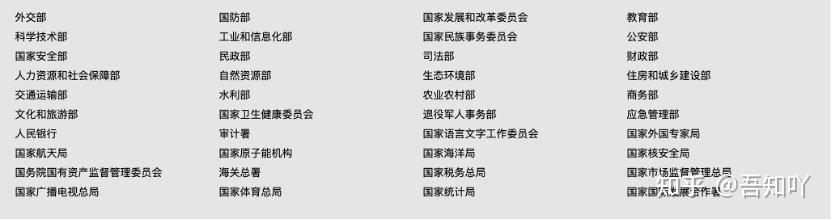

[罗布乐思 (roblox.cn)](https://roblox.cn/)

[游戏产业网-游戏工委官方网站 (cgigc.com.cn)](http://www.cgigc.com.cn/)

[首页 - 2020国际数据中心及云计算产业展览会 (cdc-expo.com)](https://www.cdc-expo.com/CDCE20/idx/simp/首页)

[App Annie | The App Analytics and App Data Industry Standard](https://www.appannie.com/cn/)

[谷歌分享：进军东南亚手游市场，如何获客取用户？ (qq.com)](https://mp.weixin.qq.com/s/jJQjlbo0scz119AXn3Lauw)

[调查报告揭中美玩家差异：中国玩家喜欢厮杀与收集 - 知乎 (zhihu.com)](https://zhuanlan.zhihu.com/p/51618511)

[[UnrealCircle深圳\] puerts-UE下TypeScript编程插件 | 腾讯 车雄生_哔哩哔哩_bilibili](https://www.bilibili.com/video/BV1oB4y1A7dY)

[2020中国移动游戏质量白皮书-WeTest_pdf (sohu.com)](https://www.sohu.com/a/444566872_120855974)

[2020年游戏行业深度分析报告 - 百度文库 (baidu.com)](https://wenku.baidu.com/view/4ba01a6812a6f524ccbff121dd36a32d7375c7eb.html)

[易观分析-数据驱动精益成长 (analysys.cn)](https://www.analysys.cn/)

[Newzoo中国 | 全球游戏市场研究及数据分析专业服务](https://newzoo.com/about/chinese/)

作者：吾知吖
链接：https://www.zhihu.com/question/438907767/answer/1688450162
来源：知乎
著作权归作者所有。商业转载请联系作者获得授权，非商业转载请注明出处。

**1、萝卜投研：**[https://robo.datayes.com](https://link.zhihu.com/?target=https%3A//robo.datayes.com/) 看数据、下载研报、上市公司PE/PB研究等。

**2、镝数聚：**[www.dydata.io](https://link.zhihu.com/?target=http%3A//t.cn/A6tfaVy4) 全行业数据&报告查找下载平台，覆盖100+行业报告及统计数据，支持报告与数据交叉查询。

**3、慧博投研资讯：**[http://www.hibor.com.cn](https://link.zhihu.com/?target=http%3A//www.hibor.com.cn/) 专业的研报大数据平台，分享行业、券商、股票等最新研究报告。

**4、阿里研究院：**[http://www.aliresearch.com/cn/index](https://link.zhihu.com/?target=http%3A//www.aliresearch.com/cn/index) 阿里巴巴出品的研究报告。

**5、腾讯大数据：**[https://data.qq.com/reports](https://link.zhihu.com/?target=https%3A//data.qq.com/reports) 腾讯出品的研究报告。

**6、360互联网安全中心：** [https://zt.360.cn/report/](https://link.zhihu.com/?target=https%3A//zt.360.cn/report/) 360出品的研究报告。

**7、易观分析：**[https://www.analysys.cn](https://link.zhihu.com/?target=https%3A//www.analysys.cn/) 以海量数字用户资产及算法模型为核心的大数据分析工具、产品及解决方案。

**8、股票报告网：**[http://www.nxny.com/stype_hy/](https://link.zhihu.com/?target=http%3A//www.nxny.com/stype_hy/) 提供各大证券公司的研究报告。

**9、艾媒网：**[https://www.iimedia.cn](https://link.zhihu.com/?target=https%3A//www.iimedia.cn/) 覆盖了新技术、新零售、教育、生物、医疗、出行、房产、营销、文娱、传媒、金融、制造、区块链、环保与公共治理等新兴领域。

**10、上海证券交易所：**[http://www.sse.com.cn](https://link.zhihu.com/?target=http%3A//www.sse.com.cn/) 提供交易数据、行业研究报告、上市公司信息披露等。

**11、深圳证券交易所：**[http://www.szse.cn](https://link.zhihu.com/?target=http%3A//www.szse.cn/) 提供深市交易数据、行业研究报告、上市公司信息披露等。

**12、艺恩：**[https://www.endata.com.cn/index.html](https://link.zhihu.com/?target=https%3A//www.endata.com.cn/index.html) 娱乐行业研究报告、电影、电视、网络剧等。

**13、卡思数据：**[https://www.caasdata.com/index/index/index.html](https://link.zhihu.com/?target=https%3A//www.caasdata.com/index/index/index.html) 视频内容行业风向标，网红分析、网红研究报告。

**14、旅游圈：**[https://www.dotour.cn/](https://link.zhihu.com/?target=https%3A//www.dotour.cn/) 旅游行业研究报告。

**15、IT桔子：**[https://www.itjuzi.com/](https://link.zhihu.com/?target=https%3A//www.itjuzi.com/) 中国创业公司投融资资讯、初创企业信息、创业公司投融资报告等。

**16、投中网：**[https://www.chinaventure.com.cn/index.html](https://link.zhihu.com/?target=https%3A//www.chinaventure.com.cn/index.html) 投融资行业报告。

**17、199IT-中文互联网数据资讯网：**提供全行业研究报告，内容详实、板块众多。

[http://www.199it.com/](https://link.zhihu.com/?target=http%3A//www.199it.com/)

**18、中国互联网络信息中心：**包含中国互联网发展所有数据，当普查数据看就可以。

[http://www.cnnic.cn](https://link.zhihu.com/?target=http%3A//www.cnnic.cn/)

**19、艾瑞网：**互联网及电信相关领域研究成果，融合行业资源；为业内人士提供丰富的产业资讯、数据、报告、专家观点、行业数据库等服务

[https://www.iresearch.cn](https://link.zhihu.com/?target=https%3A//www.iresearch.cn/)

**20、麦肯锡：**[https://www.mckinsey.com.cn](https://link.zhihu.com/?target=https%3A//www.mckinsey.com.cn/) 管理咨询公司金字塔尖的存在，提供各行业最新资讯、行业洞见等。

**21、波士顿：**[https://www.bcg.com/zh-cn/](https://link.zhihu.com/?target=https%3A//www.bcg.com/zh-cn/) 对几十个行业有前沿思考，可以作为一般结论使用。

**22、贝恩：**[https://www.bain.cn](https://link.zhihu.com/?target=https%3A//www.bain.cn/) 有研报、未来趋势预判、全球视野、聚焦中国等。

**23、JP Morgan（摩根大通）：**[https://www.jpmorgan.com/global](https://link.zhihu.com/?target=https%3A//www.jpmorgan.com/global) 对未来经济的预判等。

**24、四大：**都具备对未来趋势的研究报告，部分内容可以直接引用作为结论。

**德勤：**[https://www2.deloitte.com/cn/zh.html](https://link.zhihu.com/?target=https%3A//www2.deloitte.com/cn/zh.html)

**安永：**[https://www.ey.com/zh_cn](https://link.zhihu.com/?target=https%3A//www.ey.com/zh_cn)

**毕马威：**[https://home.kpmg/cn/zh/home.html](https://link.zhihu.com/?target=https%3A//home.kpmg/cn/zh/home.html)

**普华永道：**[https://www.pwccn.com/zh](https://link.zhihu.com/?target=https%3A//www.pwccn.com/zh)

**25、罗兰贝格：**[https://www.rolandberger.com/zh/?country=CN](https://link.zhihu.com/?target=https%3A//www.rolandberger.com/zh/%3Fcountry%3DCN) 来自德国的顶级咨询公司。

**26、怡安翰威特：**[https://www.aonhewitt.com.cn/home](https://link.zhihu.com/?target=https%3A//www.aonhewitt.com.cn/home) 人力资源方面的咨询公司。

**27:美世咨询：**[https://www.mercer.com.cn/?campaign=meishi&term=meishi](https://link.zhihu.com/?target=https%3A//www.mercer.com.cn/%3Fcampaign%3Dmeishi%26term%3Dmeishi)世界最大的人力资源管理咨询机构。

**28、中国通信院：**[http://www.caict.ac.cn/kxyj/qwfb/qwsj/](https://link.zhihu.com/?target=http%3A//www.caict.ac.cn/kxyj/qwfb/qwsj/) 智能手机出货量、手机市场运行报告、互联网企业上市企业运行报告等。

**29、IDC：**[https://www.idc.com/](https://link.zhihu.com/?target=https%3A//www.idc.com/) 智能手机全球出货量、智能硬件市场消费者研究、信息技术研究报告等。

**30、CADAS：**[http://www.cadas.com.cn/](https://link.zhihu.com/?target=http%3A//www.cadas.com.cn/) 全球航空业研究报告。

**31、世界经济论坛：**[https://cn.weforum.org/](https://link.zhihu.com/?target=https%3A//cn.weforum.org/) 关于国际经济发展趋势的研究资料。

**32、坎塔尔（Kantar）：**[https://www.kantarworldpanel.com/global](https://link.zhihu.com/?target=https%3A//www.kantarworldpanel.com/global) 杂货市场份额、智能手机市场份额、消费领域研究报告等。

**33、Flurry：**[https://www.flurry.com/](https://link.zhihu.com/?target=https%3A//www.flurry.com/) 全球手机APP方面的研究报告。

**34、GSMA：**[https://www.gsma.com/mobileeconomy/](https://link.zhihu.com/?target=https%3A//www.gsma.com/mobileeconomy/) 全球移动互联网经济研究报告。

------

分割线下新添加

**35、雪球网：**[https://xueqiu.com](https://link.zhihu.com/?target=https%3A//xueqiu.com/) 给投资者提供跨市场、跨品种的数据查询、新闻订阅和互动交流服务，目前已覆盖A股、港股、美股市场。

**36、东方财富网：**[http://data.eastmoney.com/report/](https://link.zhihu.com/?target=http%3A//data.eastmoney.com/report/)  各行业研究报告；

**37、阿拉丁指数：**[https://www.aldzs.com/bg](https://link.zhihu.com/?target=https%3A//www.aldzs.com/bg)  小程序研究报告查询下载；

**38、Tobigdata数据坊：**[https://toobigdata.com/douyin/users](https://link.zhihu.com/?target=https%3A//toobigdata.com/douyin/users)  短视频KOL排行榜查询下载；

**39、跨境电商网：**[http://www.100ec.cn/zt/wmds/](https://link.zhihu.com/?target=http%3A//www.100ec.cn/zt/wmds/)  跨境电商的研究报告、信息、研报整合等；

**40、新榜报告：**[https://report.newrank.cn/index.html?bindType=report](https://link.zhihu.com/?target=https%3A//report.newrank.cn/index.html%3FbindType%3Dreport)  新媒体（公众号、短视频等）研究报告、流量排行等；

**41、中金公司：**[https://research.cicc.com/index](https://link.zhihu.com/?target=https%3A//research.cicc.com/index)  类似咨询公司的结论类观点，一般可以作为研究结论直接使用；

**42、房价查询：**[http://hao.199it.com/fang.html](https://link.zhihu.com/?target=http%3A//hao.199it.com/fang.html)  199IT子目录，查询房价指数、房价走向等；

**43、皮尤网：**[https://www.pwc.com/us/en/library.html](https://link.zhihu.com/?target=https%3A//www.pwc.com/us/en/library.html)  市场研究报告、一些洞察直接作为结论使用。

------

经一些知友提醒，以下的网站也都很有用：

**44、36氪**：[https://36kr.com](https://link.zhihu.com/?target=https%3A//36kr.com/) 独家的视角为用户深度剖析最前沿的资讯，致力于让一部分人先看到未来，内容涵盖快讯，科技，金融，投资，房产，汽车，互联网 ...

**45、国家统计局/国家统计数据：**[http://www.stats.gov.cn](https://link.zhihu.com/?target=http%3A//www.stats.gov.cn/) 包括国家GDP、CPI、人口、行业总值、社会消费品总额、分区域数据、分时间数据、国家统计公报、国际数据等等。

**46、中央人民政府：**[http://www.gov.cn/shuju/index.htm](https://link.zhihu.com/?target=http%3A//www.gov.cn/shuju/index.htm) 包括国家的政策报告、国家宏观大数据、国家经济运行情况等。

**47、世界银行：**[https://data.worldbank.org.cn](https://link.zhihu.com/?target=https%3A//data.worldbank.org.cn/) 有世界各地人口、环境、经济发展状况、性别、教育发展状况、国际贫困标准、国际债务统计、外债指标等。

**48、各省市统计局/各省市人民政府：**部分省份数据十分详实，关于该省市历史经济发展数据及未来走势都有，但部分省市的数据更新效率比较低下。

**49、工信部：**[https://www.miit.gov.cn/gxsj/index.html](https://link.zhihu.com/?target=https%3A//www.miit.gov.cn/gxsj/index.html) 包括原材料工业、装备工业、消费品工业、通信业、电子信息、软件业的统计数据。

**50、中国人民银行：**[http://www.pbc.gov.cn](https://link.zhihu.com/?target=http%3A//www.pbc.gov.cn/) 包含银行业、金融业的全部数据，可以查询行业政策、汇率、外汇水平、存贷款利率变化等。

**51、教育部：**[http://www.moe.gov.cn/s78/A03/moe_560/jytjsj_2019/qg/](https://link.zhihu.com/?target=http%3A//www.moe.gov.cn/s78/A03/moe_560/jytjsj_2019/qg/) 包含普通高校名单、各级学校教职工、学生、专任老师的情况、在校人数、在校性别比、普通学校升学率、适龄儿童入学率等。

**52、包括国务院下辖的所有部委都可以查询到官方数据。**

------

更新一下最近经常使用的国际网站，在进行对比的时候，还是需要中外数据的。

**53、世界银行：**[World Bank Open Data](https://link.zhihu.com/?target=https%3A//data.worldbank.org.cn/) 提供了许多国家的数据，包括国家债务统计、融资统计、世界发展指标等；

**54、国际货币基金组织（IMF）**：[IMF Data](https://link.zhihu.com/?target=https%3A//www.imf.org/en/Data%23data)  提供了一些最具权威的国际宏观经济数据集 ，IMF国际货币基金组织数据库分为两部分：IMF eLibrary和IMF DATA，于2020年起免费向公众开放。

**55、世卫组织：**[World Health Data Platform - WHO](https://link.zhihu.com/?target=https%3A//www.who.int/data) 新冠疫情席卷全球， 查询各个国家的疫情情况等，同样也提供在卫生方面的数据；

**56、联合国数据：**[UNdata](https://link.zhihu.com/?target=http%3A//data.un.org/)  可以查询到全世界及各个国家的数据：人口、经济、社会情况等；

**57、世贸组织：**[WTO Statistics: Trade and tariff data](https://link.zhihu.com/?target=https%3A//www.wto.org/english/res_e/statis_e/statis_e.htm) 提供贸易方面的数据；

**58、可持续发展目标**：[- SDG Indicators](https://link.zhihu.com/?target=https%3A//unstats.un.org/sdgs/indicators/database/) 未来的发展必定要走可持续发展道路，可持续发展目标显得尤为重要；

**59、人口与社会统计：**[Demographic and Social Statistics](https://link.zhihu.com/?target=https%3A//unstats.un.org/unsd/demographic-social/products/)

60、**美国证监会：**[https://www.sec.gov](https://link.zhihu.com/?target=https%3A//www.sec.gov) 美股上市公司财报、年报等。

**61、欧盟统计局：**[Database - Eurostat](https://link.zhihu.com/?target=https%3A//ec.europa.eu/eurostat/web/main/data/database)

**62、美国商务部：**[https://www.commerce.gov](https://link.zhihu.com/?target=https%3A//www.commerce.gov/)

[(22 封私信 / 80 条消息) 哪里看最新行业研报？ - 知乎 (zhihu.com)](https://www.zhihu.com/question/438907767/answer/1688450162?utm_source=ZHShareTargetIDMore&utm_medium=social&utm_oi=618129002196635648)

# 云游戏

[(22 封私信 / 80 条消息) 哪个云游戏平台比较好？ - 知乎 (zhihu.com)](https://www.zhihu.com/question/314703318)

[咪咕快游_PC电脑版云游戏平台-即点即玩 (migufun.com)](http://pc.migufun.com/)

[网易云游戏平台 (163.com)](https://cg.163.com/?invite_code=I6PFZ5#/mobile)

其他技术

[(22 封私信 / 80 条消息) 对可多人协同编辑的在线编辑器，如何设计其 undo/redo 的逻辑？ - 知乎 (zhihu.com)](https://www.zhihu.com/question/367915946/answer/2240528814)

[Roblox的渲染架构：跨越时空的元宇宙渲染 - 知乎 (zhihu.com)](https://zhuanlan.zhihu.com/p/436750122)

其他环境

[在美欧日中游戏公司工作分别是怎样的体验？ - 知乎 (zhihu.com)](https://zhuanlan.zhihu.com/p/43953054)

[中国游戏行业的未来将会如何？ - 知乎 (zhihu.com)](https://zhuanlan.zhihu.com/p/42779413)

[【随笔】我在独立游戏公司工作的那些日子 - 知乎 (zhihu.com)](https://zhuanlan.zhihu.com/p/376314959)

[看了这份员工手册，我终于知道Valve为什么是一家伟大的公司了 (qq.com)](https://mp.weixin.qq.com/s?__biz=MjM5OTc2ODUxMw==&mid=2649712393&idx=1&sn=b3fcffd8f5594794b2f9d7b7f5114dfa&chksm=bf2dbfa7885a36b18f4beb353cf5c1743971310cfa1941eb9a7f6043ceb9f939dd6c009ae58f&scene=21#wechat_redirect)

[字节跳动的游戏版图：28家公司，8大工作室，1000人团队 - 知乎 (zhihu.com)](https://zhuanlan.zhihu.com/p/272061348)

[游戏的未来 (qq.com)](https://mp.weixin.qq.com/s/T5vqeDfAz7qjvhub4Go8EQ)
