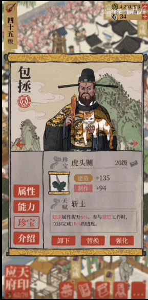
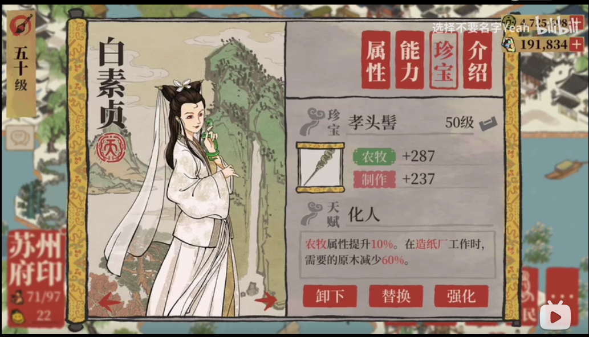

# 愿景：拥有“技术”、“艺术”、“玩法”完美结合的土壤

《纪念碑谷》画面干净漂亮、玩法巧妙

《风之旅人》画面干净漂亮，看视频就给人观感十足。

《SKY光遇》

[【SKY光遇】—《溯》_哔哩哔哩_bilibili](https://www.bilibili.com/video/BV1Ag4y1q7wg?from=search&seid=16769736166983930751&spm_id_from=333.337.0.0)

《江南百景图》的UI适配，横屏和竖屏切换做得非常屌，做出这样的效果是需要设计者了解技术

《言出法随》通过语音喊技能名释放技能的游戏（玩出火影忍者的感觉），做出这种创意，需要先了解技术，并很好的利用技术。

[【言出法随】自定义法诀更新正式上线！想喊什么喊什么.jpg_哔哩哔哩_bilibili](https://www.bilibili.com/video/BV1f54y1a7FC?from=search&seid=9858080000992485646&spm_id_from=333.337.0.0)

[【风笑试玩】千万不要在朋友面前玩这个游戏丨言出法随 试玩 (bilibili.com)](https://www.bilibili.com/video/BV1og411u7NT?from=search&seid=10443069004406491933&spm_id_from=333.337.0.0)

《我的世界》程序员设计开发的游戏。这个一个开发元功能，实现指数级组合玩法的一个游戏。这个游戏除了玩法，也是需要了解技术，并利用技术的特点。功能、美术都是尽量往通用方式做。

**差距分析：（可能比较适合独立开发团队，不太适合我们现阶段的团队，未来五年成为优先设计团队可以吸收独立开发团队的一些精神和品质****，比如在我们项目不同的阶段（做关卡、技能玩法的探索阶段），可以通过两三个人为小组进行一些探索，不要有压力的探索。****）（以下都是感觉没有根据）**

在产品设计时需要有技术、艺术、玩法完美结合的团队能力，需要有充足的时间做产品前期探索设计，懂得扬长避短。

1. 技术、艺术、玩法的结合需要综合素质都强人， 或者团队在这些合作方面非常牛逼。
2. 设计方面缺少程序的参与。一般都是在开发过程中问程序能不能实现了事，没有太多时间做探索设计。
3. 通常为什么缺少程序设计产品？一方面是程序缺少这方面的意识和经验，另外程序被手上工作压得喘不过气，没心思参与设计。

相关链接

[数学、艺术与游戏的结合：《纪念碑谷》设计师专访 - 触乐 (chuapp.com)](http://www.chuapp.com/2014/03/28/18967.html)

[(22 封私信 / 58 条消息) 制作纪念碑谷 ( Monument Valley ) 的 ustwo 是一家什么样的公司？ - 知乎 (zhihu.com)](https://www.zhihu.com/question/23708880/answer/69317991)

[饱经磨砺的灵感与坚持 开发者谈《纪念碑谷》诞生的背后 - 触乐 (chuapp.com)](http://www.chuapp.com/2014/04/25/26235.html)

[纪念碑谷Ⅰ，Ⅱ全关卡合集_哔哩哔哩_bilibili](https://www.bilibili.com/video/BV1P4411h727?from=search&seid=16608999217374498922&spm_id_from=333.337.0.0)

[(22 封私信 / 58 条消息) 还有哪些像《纪念碑谷》这样接近艺术的游戏？ - 知乎 (zhihu.com)](https://www.zhihu.com/question/23371505/answer/2101384372)

[风 之 旅 人【全流程实况，唯美神作】_哔哩哔哩_bilibili](https://www.bilibili.com/video/BV1Nb411175F?from=search&seid=12371109669348870295&spm_id_from=333.337.0.0)

[(22 封私信 / 58 条消息) 像陈星汉的thatgamecompany这样的工作室可能像Valve那样做大做强吗？ - 知乎 (zhihu.com)](https://www.zhihu.com/question/30758676/answer/49338753)

[饥荒：《神话书说》，为数不多的超良心国产Mod，终于等到你 (baidu.com)](https://baijiahao.baidu.com/s?id=1664187823339147337&wfr=spider&for=pc)

[特写丨专访最伟大的华裔游戏制作人陈星汉：人生如逆旅，我亦是行人 - 知乎 (zhihu.com)](https://zhuanlan.zhihu.com/p/26193904)

[霸榜Steam十年的高智商游戏！最顶级的游戏设计是什么样的？|《传送门》系列【这才叫游戏#11】_单机游戏热门视频 (bilibili.com)](https://www.bilibili.com/video/BV1B44y1x7oW?from=search&seid=14904471024311633227&spm_id_from=333.337.0.0)

# 愿景：能够远程办公的环境

Facebook更名**元宇宙（Metaverse)**, 主力发展VR，第一步先实现“地平线工作室”项目，“地平线工作室”是一个虚拟办公环境，解决现在视频会议没有办公环境氛围感。

优点：

可以不来公司，这样公司可以不受人所在地的限制。员工有更多的自由感。

社恐的人感觉会很爽，非常爽。

提高每个人的生活质量，远程办公的人拥有更大的灵活性来安排自己的工作时间，能够在日常工作中提供最大的生产力，从而建立更好的工作前景。

生活在大城市的人都可以搬到小城市，享受低廉的生活成本和更高的生活质量。

缺点：

过量的工作：

有些公司担心远程办公的员工不能完成足够的工作。然而事实恰恰相反，远程办公的员工会因为过量的工作而筋疲力尽，各个公司都必须解决这个问题。

避免分心：家庭办公室将迅速普及。每个家庭都需要一块单独的办公空间。

[【搬运.老高与小茉】千萬不要錯過，將徹底改變世界的元宇宙_哔哩哔哩_bilibili](https://www.bilibili.com/video/BV1aU4y1g7iU?from=search&seid=5586291974291155922&spm_id_from=333.337.0.0)

[Meta/Facebook元宇宙办公概念_哔哩哔哩_bilibili](https://www.bilibili.com/video/BV1T34y1U7tF?from=search&seid=12759106561870707046&spm_id_from=333.337.0.0)

[Facebook可能计划更名，已提前布局转型元宇宙公司 - 知乎 (zhihu.com)](https://zhuanlan.zhihu.com/p/425614992)

[(22 封私信 / 60 条消息) 如何看待 Facebook 可能下周改名？ - 知乎 (zhihu.com)](https://www.zhihu.com/question/493613928)

[(22 封私信 / 60 条消息) 为什么国内公司远程办公发展滞后？ - 知乎 (zhihu.com)](https://www.zhihu.com/question/47284405/answer/2135124481)

[(22 封私信 / 60 条消息) 远程办公会不会在未来五到十年成为普遍现象？ - 知乎 (zhihu.com)](https://www.zhihu.com/question/368686836/answer/1099050625)

[(22 封私信 / 60 条消息) 国内哪些公司可以在家远程工作？ - 知乎 (zhihu.com)](https://www.zhihu.com/question/49427454/answer/2090270117)

[知乎盐选 | Google 是如何远程办公的 (zhihu.com)](https://www.zhihu.com/market/paid_magazine/1251138714908356608/section/1251138766242529280?origin_label=search)

[(22 封私信 / 60 条消息) 国内允许远程办公的公司有哪些? - 知乎 (zhihu.com)](https://www.zhihu.com/question/21274834)

[国内有哪些公司可以在家远程办公 - 知乎 (zhihu.com)](https://zhuanlan.zhihu.com/p/404654714)

[调查完 150 个远程办公团队，我们发现了这几个真相 - 知乎 (zhihu.com)](https://zhuanlan.zhihu.com/p/106936149)

[远程会议办公已成大趋势，其最佳协作方式就是虚拟办公_工作 (sohu.com)](https://www.sohu.com/a/298302199_100068454)

www.freemancn.com 

