# 相关文档

[GitHub Pages 快速入门 - GitHub 文档](https://docs.github.com/zh/pages/quickstart)

[Github Pages + jekyll 全面介绍极简搭建个人网站和博客 - 知乎 (zhihu.com)](https://zhuanlan.zhihu.com/p/51240503)

[欢迎 - Jekyll • 简单静态博客网站生成器 (jekyllcn.com)](https://jekyllcn.com/docs/home/)

[使用 site.github |GitHub 元数据 (jekyll.github.io)](https://jekyll.github.io/github-metadata/site.github/)


模板

[页面主题样式 Supported themes | GitHub Pages](https://pages.github.com/themes/)

[GitHub Pages themes](https://github.com/pages-themes)

[Jekyll Themes](http://jekyllthemes.org/)

[Sites · jekyll/jekyll Wiki (github.com)](https://github.com/jekyll/jekyll/wiki/sites)


评论

[关于静态博客的评论系统 - 张宸blog - 博客园 (cnblogs.com)](https://www.cnblogs.com/nodecat/p/13058292.html)


# 1.github设置
### 1.1 设置启用page

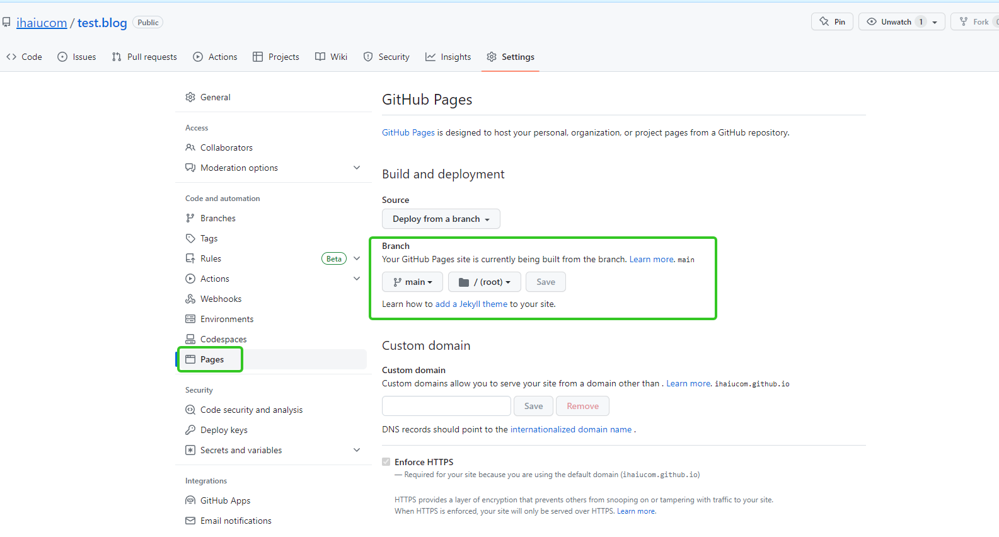

```
设置完分支，就可以用这个地址访问了。
默认访问的是 README.md

https://${用户名}.github.io/test.blog/
```

[https://ihaiucom.github.io/test.blog/](https://ihaiucom.github.io/test.blog/)

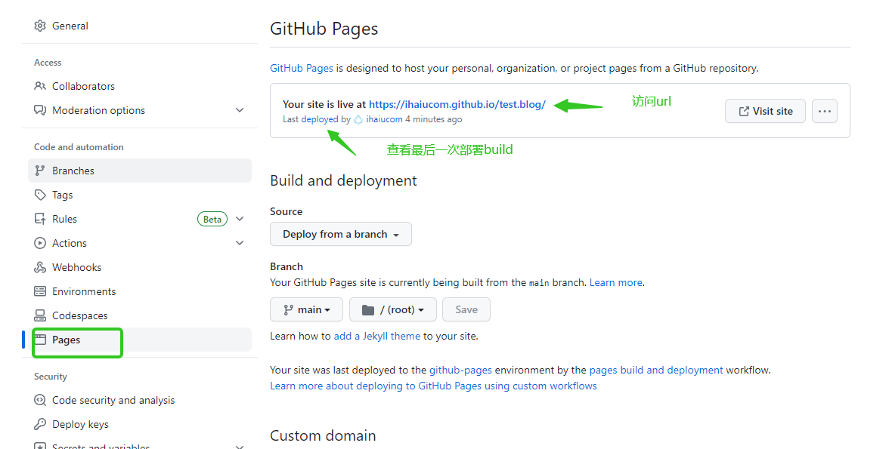

**访问文件优先级:**

index.html > index.md > README.md


### 1.2 设置自己的域名

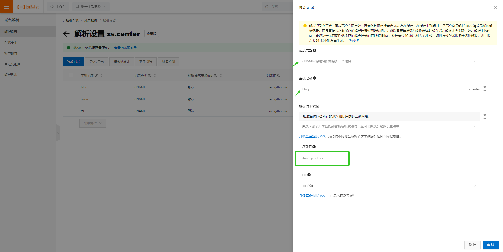


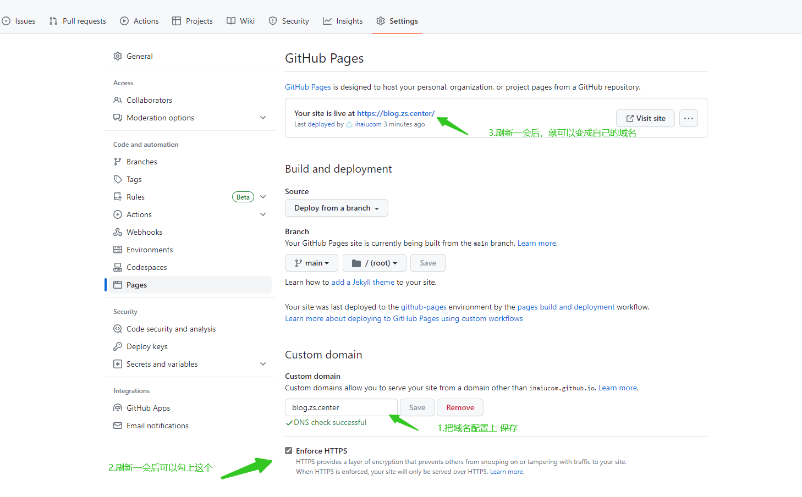


配置完会添加一个文件CNAME

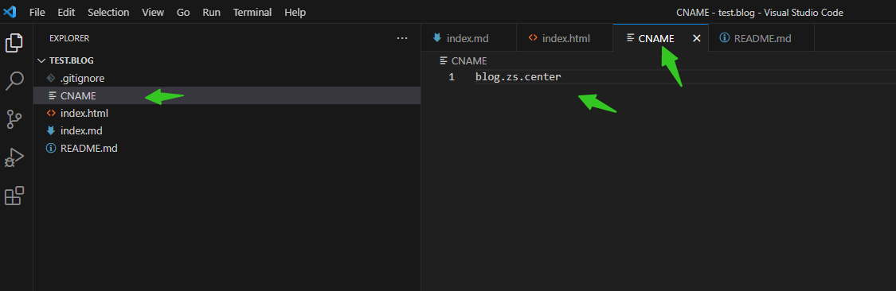


[https://blog.zs.center](https://blog.zs.center/)

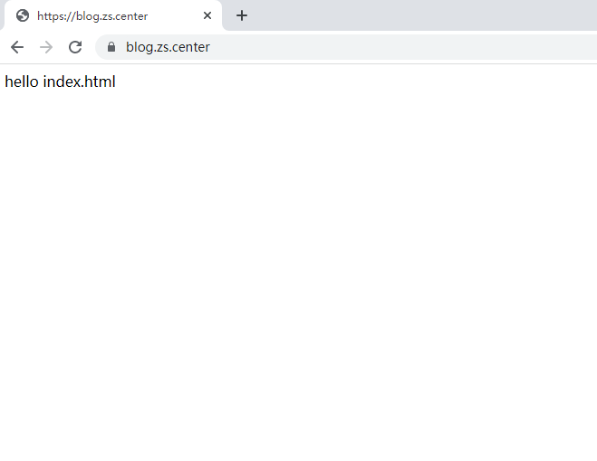


# 2.用Jekyll来配置生成静态网站框架

### 2.1 目录结构

[目录结构 - Jekyll • 简单静态博客网站生成器 (jekyllcn.com)](http://jekyllcn.com/docs/structure/)

```
|-- blog
    |-- _config.yml -- 全局配置文件 
    |-- _layouts  -- 模板
    |-- _includes   -- 可以重复在其他界面导入的模块
    |-- _data   -- 数据(新版本支持)
    |-- _posts   -- 博客文章
    |-- assets   -- 静态资源
        |-- js
        |-- css
        |-- image
    |-- index.md   -- 首页

```


### 2.2 _layouts 模板

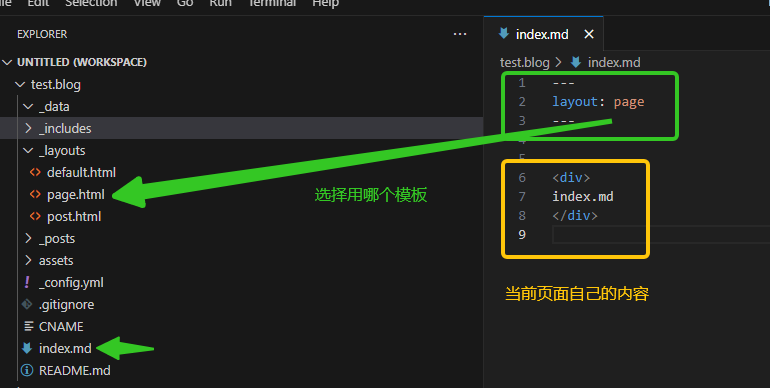

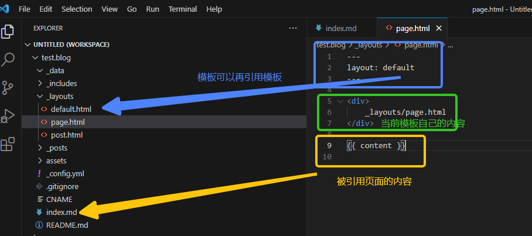

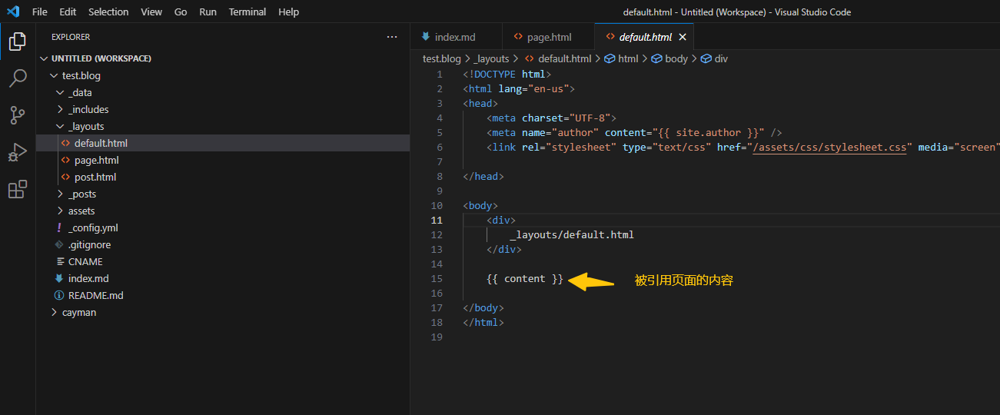


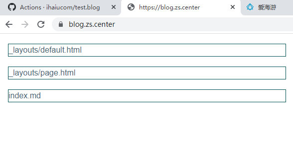


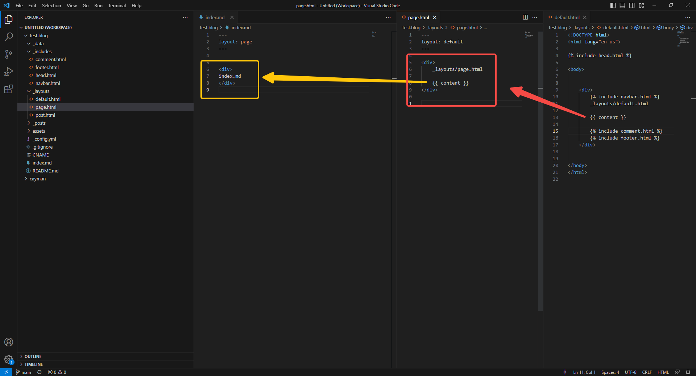

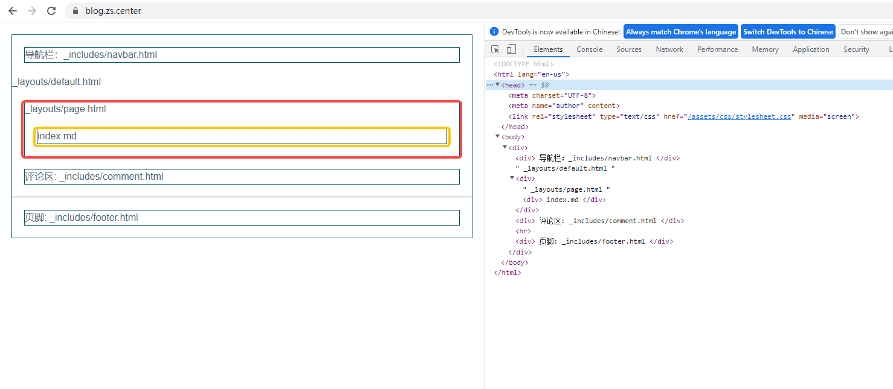


### 2.3  _includes 模块

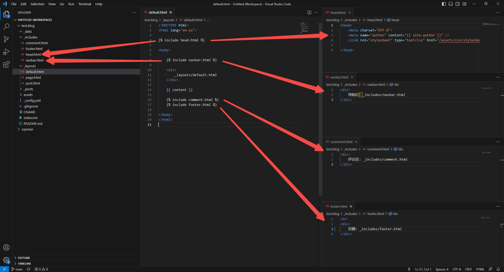

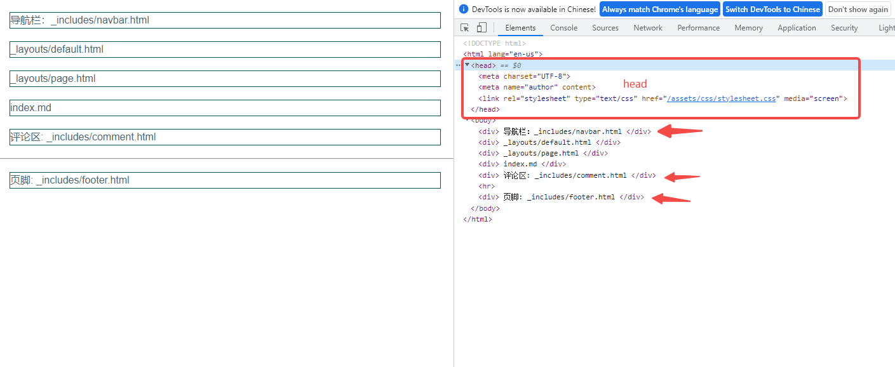


### 2.4 _posts 博客文章

[常用变量 - Jekyll • 简单静态博客网站生成器 (jekyllcn.com)](http://jekyllcn.com/docs/variables/)


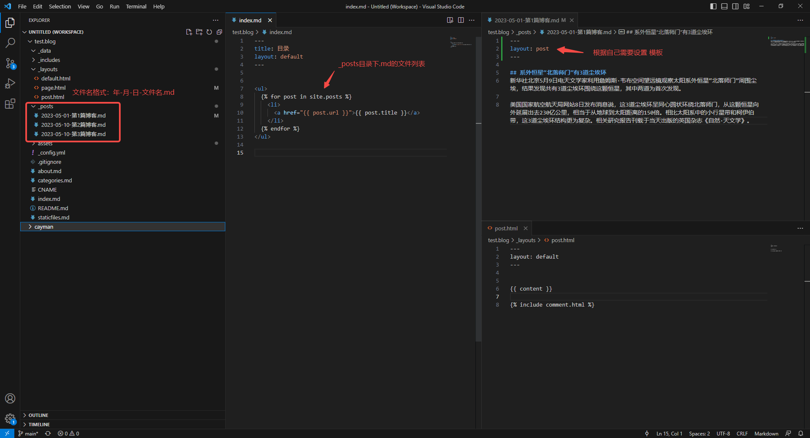

#### 显示文章目录

[常用变量 - Jekyll • 简单静态博客网站生成器 (jekyllcn.com)](http://jekyllcn.com/docs/variables/#页面page变量)

https://blog.zs.center/index-posts/#content

```html
<ul>
  
    <li>
      <a href="{{ post.url }}">{{ post.title }}</a>
    </li>
  
</ul>
```


#### 设置链接方式

在 _config.yml

```yaml

# 默认形式：https://blog.zs.center/2023/05/01/第1篇博客.html
# 修改后: https://blog.zs.center/第1篇博客/
permalink: /:title/
```


### 2.5 page info 页面头信息

[头信息 - Jekyll • 简单静态博客网站生成器 (jekyllcn.com)](http://jekyllcn.com/docs/frontmatter/)

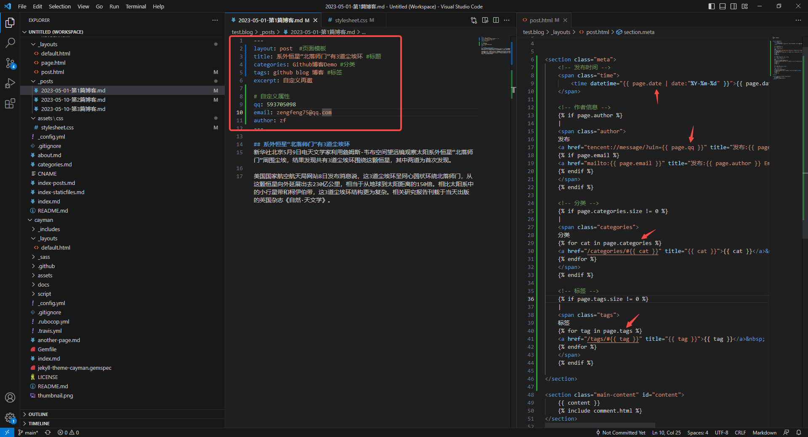

### 2.6 语法

#### for

```html

      <a href="{{ post.url }}">{{ post.title }}</a>

```


### 2.7 分页

[分页功能 - Jekyll • 简单静态博客网站生成器 (jekyllcn.com)](http://jekyllcn.com/docs/pagination/)

[常用变量 - Jekyll • 简单静态博客网站生成器 (jekyllcn.com)](http://jekyllcn.com/docs/variables/#分页器paginator)


#### 设置分页，每页数量

_config.yml

```yaml
paginate: 20 #设置分页，每页数量
```

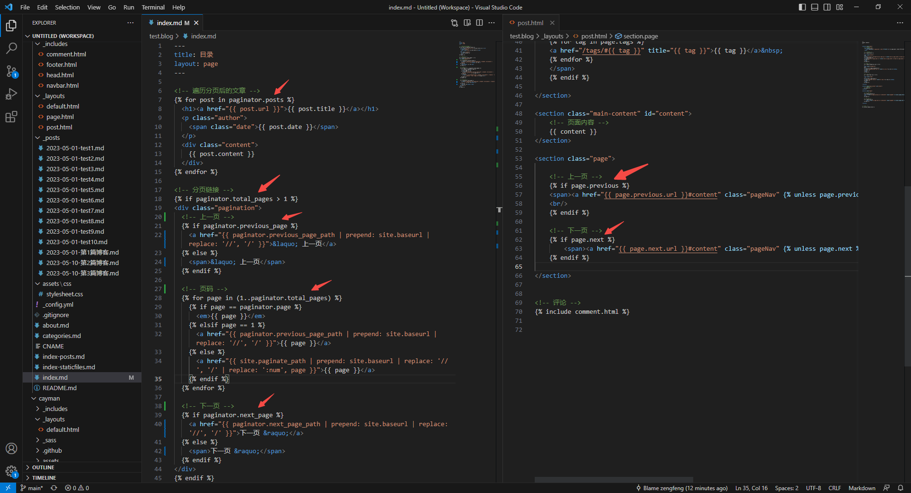


# 3.评论

[utterances](https://utteranc.es/)

[博客使用 utterances 作为评论系统 - 掘金 (juejin.cn)](https://juejin.cn/post/6844903834712539150)


# 4.编辑器工具

[Typora 官方中文站 (typoraio.cn)](https://typoraio.cn/)

https://huanle.feishu.cn/file/boxcnIqvMVztdTRwKKPmSKaekoh