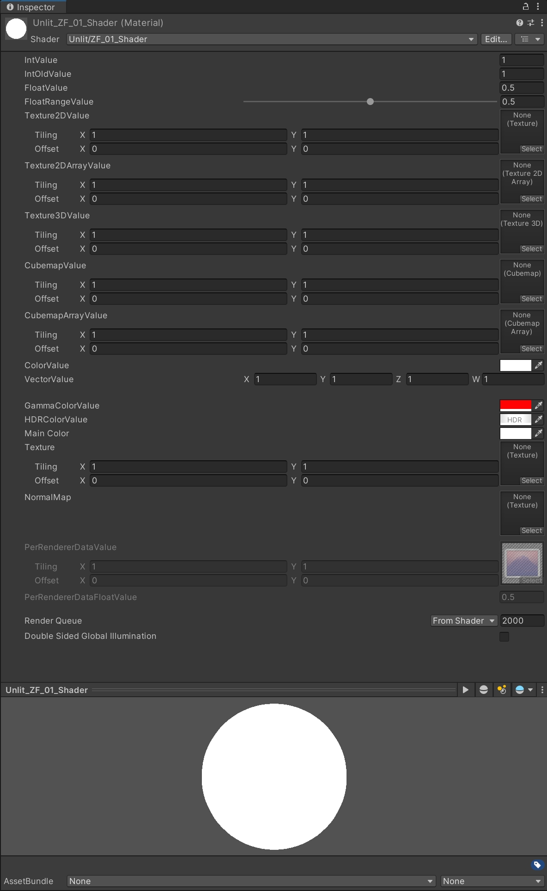

[TOC]


# 模板

## Shader 模块

```glsl
Shader "Examples/ShaderSyntax"
{

    Properties
    {
        // 此处是材质属性声明
    }
    SubShader
    {
        // 此处是定义子着色器的其余代码

        Pass
        {
           // 此处是定义通道的代码
        }
    }

    // 回退
    Fallback "ExampleFallbackShader"
    
    // 自定义编辑器
    CustomEditor = "ExampleCustomEditor"
}
```


### Properties 代码块

[ShaderLab：定义材质属性 - Unity 手册](https://docs.unity.cn/cn/2022.3/Manual/SL-Properties.html)


#### Properties 类型

| **类型**           | **示例语法**                                                 | **注释**                                                     |
| :----------------- | :----------------------------------------------------------- | :----------------------------------------------------------- |
| **整数**           | `_ExampleName ("Integer display name", Integer) = 1`         | This type is backed by a real integer (unlike the legacy `Int` type described below, which is backed by a float). Use this instead of Int when you want to use an integer. |
| **Int**（旧版）    | `_ExampleName ("Int display name", Int) = 1`                 | **Note:** This legacy type is backed by a float, rather than an integer. It is supported for backwards compatibility reasons only. Use the `Integer` type instead. |
| **Float**          | `_ExampleName ("Float display name", Float) = 0.5`  `_ExampleName ("Float with range", Range(0.0, 1.0)) = 0.5` | 范围滑动条的最大值和最小值包含在内。                         |
| **Texture2D**      | `_ExampleName ("Texture2D display name", 2D) = "" {}`  `_ExampleName ("Texture2D display name", 2D) = "red" {}` | 将以下值置于默认值字符串中可使用 Unity 的内置纹理之一：“white”（RGBA：1,1,1,1）、“black”（RGBA：0,0,0,1）、“gray”（RGBA：0.5,0.5,0.5,1）、“bump”（RGBA：0.5,0.5,1,0.5）或“red”（RGBA：1,0,0,1）。  如果将该字符串留空或输入无效值，则它默认为 “gray”。  **注意：**这些默认纹理在 Inspector 中不可见。 |
| **Texture2DArray** | `_ExampleName ("Texture2DArray display name", 2DArray) = "" {}` | 有关更多信息，请参阅[纹理数组](https://docs.unity.cn/cn/2022.3/Manual/class-Texture2DArray.html)。 |
| **Texture3D**      | `_ExampleName ("Texture3D", 3D) = "" {}`                     | 默认值为 “gray”（RGBA：0.5,0.5,0.5,1）纹理。                 |
| **Cubemap**        | `_ExampleName ("Cubemap", Cube) = "" {}`                     | 默认值为 “gray”（RGBA：0.5,0.5,0.5,1）纹理。                 |
| **CubemapArray**   | `_ExampleName ("CubemapArray", CubeArray) = "" {}`           | 请参阅[立方体贴图数组](https://docs.unity.cn/cn/2022.3/Manual/class-CubemapArray.html)。 |
| **Color**          | `_ExampleName("Example color", Color) = (.25, .5, .5, 1)`    | 这会在着色器代码中映射到 float4。  材质 Inspector 会显示一个拾色器。如果更愿意将值作为四个单独的浮点数进行编辑，请使用 Vector 类型。 |
| **Vector**         | `_ExampleName ("Example vector", Vector) = (.25, .5, .5, 1)` | 这会在着色器代码中映射到 float4。  材质 Inspector 会显示四个单独的浮点数字段。如果更愿意使用拾色器编辑值，请使用 Color 类型。 |


#### Properties 材质属性特性

| **属性**            | **功能**                                                     |
| :------------------ | :----------------------------------------------------------- |
| `[Gamma]`           | 指示浮点数或矢量属性使用 sRGB 值，这意味着如果项目中的颜色空间需要，则它必须与其他 sRGB 值一起转换。有关更多信息，请参阅[着色器程序中的属性](https://docs.unity.cn/cn/2022.3/Manual/SL-PropertiesInPrograms.html)。 |
| `[HDR]`             | 指示纹理或颜色属性使用[高动态范围 (HDR)](https://docs.unity.cn/cn/2022.3/Manual/HDR.html) 值。  对于纹理属性，如果分配了 LDR 纹理，则 Unity 编辑器会显示警告。对于颜色属性，Unity 编辑器会使用 HDR 拾色器编辑此值。 |
| `[HideInInspector]` | 告知 Unity 编辑器在 Inspector 中隐藏此属性。                 |
| `[MainTexture]`     | 为材质设置主纹理，可以使用 [Material.mainTexture](https://docs.unity.cn/cn/2022.3/ScriptReference/Material-mainTexture.html) 进行访问。  默认情况下，Unity 将具有属性名称 `_MainTex` 的纹理视为主纹理。如果纹理具有不同的属性名称，但希望 Unity 将它视为主纹理，请使用此特性。  如果多次使用此特性，则 Unity 会使用第一个属性并忽略后续属性。  **注意：**使用此特性设置主纹理时，如果使用纹理串流调试视图模式或自定义调试工具，则该纹理在游戏视图中不可见。 |
| `[MainColor]`       | 为材质设置主色，可以使用 [Material.color](https://docs.unity.cn/cn/2022.3/ScriptReference/Material-color.html) 进行访问。  默认情况下，Unity 将具有属性名称 `_Color` 的颜色视为主色。如果您的颜色具有其他属性 (property) 名称，但您希望 Unity 将这个颜色视为主色，请使用此属性 (attribute)。如果您多次使用此属性 (attribute)，则 Unity 会使用第一个属性 (property)，而忽略后续属性 (property)。 |
| `[NoScaleOffset]`   | 告知 Unity 编辑器隐藏此纹理属性的平铺和偏移字段。            |
| `[Normal]`          | 指示纹理属性需要法线贴图。  如果分配了不兼容的纹理，则 Unity 编辑器会显示警告。 |
| `[PerRendererData]` | 指示纹理属性将来自每渲染器数据，形式为 [MaterialPropertyBlock](https://docs.unity.cn/cn/2022.3/ScriptReference/MaterialPropertyBlock.html)。  材质 Inspector 会将这些属性显示为只读。 |


```glsl
Shader "Unlit/ZF_01_Shader"
{
    Properties
    {
        
        //============================
        // 类型
        //----------------------------
        
        // 整数
        _IntValue("IntValue", Integer) = 1
        
        // 旧版 Int
        _IntOldValue("IntOldValue", Int) = 1
        
        // 浮点数
        _FloatValue("FloatValue", Float) = 0.5
        
        // 浮点数范围    
        _FloatRangeValue("FloatRangeValue", Range(0.0, 1.0)) = 0.5
        
        // 纹理 2D
        _Texture2DValue("Texture2DValue", 2D) = "white" {}
        
        // 纹理 2D 数组
        _Texture2DArrayValue("Texture2DArrayValue", 2DArray) = "" {}
        
        // 纹理 3D
        _Texture3DValue("Texture3DValue", 3D) = "" {}
        
        // 立方体贴图
        _CubemapValue("CubemapValue", Cube) = "" {}
        
        // 立方体贴图数组
        _CubemapArrayValue("CubemapArrayValue", CubeArray) = "" {}
        
        // 颜色
        _ColorValue("ColorValue", Color) = (1, 1, 1, 1)
        
        // 向量
        _VectorValue("VectorValue", Vector) = (1, 1, 1, 1)
        
        
        //============================
        // 材质属性特性
        //----------------------------
        // [Gamma]颜色
        [Gamma]	_GammaColorValue("GammaColorValue", Color) = (1, 1, 1, 1)
        // [HDR]颜色
        [HDR] _HDRColorValue("HDRColorValue", Color) = (1, 1, 1, 1)
        // [MainColor]颜色
        [MainColor] _Color("Main Color", Color) = (1, 1, 1, 1)
        // [MainTexture]纹理
        [MainTexture] _MainTex ("Texture", 2D) = "white" {}
        // [Normal] [NoScaleOffset] 纹理
        [Normal] [NoScaleOffset] _NormalMap ("NormalMap", 2D) = "white" {}
        // [HideInInspector] 隐藏属性
        [HideInInspector] _HideValue("HideValue", Float) = 0.5
        // [PerRendererData] 材质属性块
        [PerRendererData] _PerRendererDataValue("PerRendererDataValue", 2D) = "white" {}
        [PerRendererData] _PerRendererDataFloatValue("PerRendererDataFloatValue", float) = 0.5
        
    }
    
    ....
        
}
```




### Fallback 分配回退

[ShaderLab：分配回退 - Unity 手册](https://docs.unity.cn/cn/2022.3/Manual/SL-Fallback.html)


### CustomEditor 和 CustomEditorForRenderPipeline 指定编辑器

[ShaderLab：指定自定义编辑器 - Unity 手册](https://docs.unity.cn/cn/2022.3/Manual/SL-CustomEditor.html)


## SubShader

[ShaderLab：定义子着色器 - Unity 手册](https://docs.unity.cn/cn/2023.2/Manual/SL-SubShader.html)


### LOD

以下代码执行结果

- LOD < 100 : 执行 200的SubShader，因为没有100 以下的LOD，所以执行第一个
- 100 <= LOD < 200 ： 执行100的SubShader
- 200 <= LOD : 执行200的SubShader

```glsl
Shader "Examples/ExampleLOD"
{
    SubShader
    {
        LOD 200

        Pass
        {                
              // 此处是定义通道的代码的其余部分。
        }
    }

    SubShader
    {
        LOD 100

        Pass
        {                
              // 此处是定义通道的代码的其余部分。
        }
    }
}
```

```c#
using UnityEngine;

[ExecuteInEditMode]
public class ShaderLod : MonoBehaviour
{
    [Range(0, 1000)]
    public  int lod = 0;

    void Update()
    {
        Shader.globalMaximumLOD = lod;
    }
}

```


### SubShader Tags

[ShaderLab：向子着色器分配标签 - Unity 手册](https://docs.unity.cn/cn/2023.2/Manual/SL-SubShaderTags.html)

渲染管线兼容性

| **功能名称**                                     | **内置渲染管线** | **通用渲染管线 (URP)** | **高清渲染管线 (HDRP)**                    | **自定义 SRP**                                               |
| :----------------------------------------------- | :--------------- | :--------------------- | :----------------------------------------- | :----------------------------------------------------------- |
| **ShaderLab：子着色器标签代码块**                | 是               | 是                     | 是                                         | 是                                                           |
| **ShaderLab：RenderPipeline 子着色器标签**       | 否               | 是                     | 是                                         | 否                                                           |
| **ShaderLab：Queue 子着色器标签**                | 否               | 是                     | 是                                         | 是  **注意：**在自定义 SRP 中，可以定义自己的渲染顺序并选择是否要使用渲染队列。有关更多信息，请参阅 DrawingSettings 和 SortingCriteria。 |
| **ShaderLab：RenderType 子着色器标签**           | 是               | 是                     | 是                                         | 是                                                           |
| **ShaderLab：DisableBatching 子着色器标签**      | 是               | 是                     | 是                                         | 是                                                           |
| **ShaderLab：ForceNoShadowCasting 子着色器标签** | 是               | 是                     | 是  这会禁用常规阴影，但是不影响接触阴影。 | 是                                                           |
| **ShaderLab：CanUseSpriteAtlas 子着色器标签**    | 是               | 是                     | 是                                         | 是                                                           |
| **ShaderLab：PreviewType 子着色器标签**          | 是               | 是                     | 是                                         | 是                                                           |

```glsl

    SubShader
    {
        Tags { 
            
            // 渲染管线标签， [UniversalRenderPipeline, HighDefinitionRenderPipeline, 自定义管线]
            "RenderPipeline" = "UniversalRenderPipeline"
            
            // 队列标签， [Background, Geometry, AlphaTest, Transparent, Overlay, 正数]
            "Queue" = "Transparent"
            
            // 渲染类型标签， [Opaque, Transparent, Cutout, Fade, Overlay,TreeOpaque, TreeTransparentCutout, TreeBillboard, Grass, GrassBillboard]
            "RenderType"="Opaque" 
            
            // 是否阻止接受阴影标签， [True, False]
            "ForceNoShadowCasting" = "False"
            
            // 是否禁用批处理标签， [True, False, LODFading] // LODFading:对于属于 Fade Mode 值不为 None 的 LODGroup 一部分的所有几何体，Unity 会阻止动态批处理。否则，Unity 不会阻止动态批处理。
            "DisableBatching" = "True"
            
            // 是否忽略投影标签， [True, False]， 只在内置渲染管线中有效
            "IgnoreProjector" = "True"
            
            // 预览类型标签， [ Sphere, Plane,Skybox]
            "PreviewType" = "Sphere"
            
            // 是否可以使用精灵图集标签， [True, False]， 默认值是True
            "CanUseSpriteAtlas" = "False"  
            
        }
        ...
    }
```


#### RenderPipeline 标签

`RenderPipeline` 标签向 Unity 告知子着色器是否与通用渲染管线 (URP) 或高清渲染管线 (HDRP) 兼容。

**语法和有效值**

| **签名**                    | **功能**                                         |
| :-------------------------- | :----------------------------------------------- |
| “RenderPipeline” = “[name]” | 向 Unity 告知此子着色器是否与 URP 或 HDRP 兼容。 |

| **参数** | **值**                       | **功能**                          |
| :------- | :--------------------------- | :-------------------------------- |
| [name]   | UniversalRenderPipeline      | 此子着色器仅与 URP 兼容。         |
|          | HighDefinitionRenderPipeline | 此子着色器仅与 HDRP 兼容。        |
|          | （任何其他值，或未声明）     | 此子着色器与 URP 和 HDRP 不兼容。 |

```glsl
Shader "ExampleShader" {
    SubShader {
        Tags { "RenderPipeline" = "UniversalRenderPipeline" }
        Pass {
            …
        }
    }
}
```


#### Queue 标签

[Material-GetTag - Unity 脚本 API](https://docs.unity.cn/cn/2023.2/ScriptReference/Material.GetTag.html)


`Queue` 标签向 Unity 告知要用于它渲染的几何体的渲染队列。渲染队列是确定 Unity 渲染几何体的顺序的因素之一。

**语法和有效值**

可以通过两种方式使用 `Queue` 标签：可以告知 Unity 使用命名渲染队列，或是它在命名渲染队列之后渲染的未命名渲染队列。

| **签名**                            | **功能**                                                     |
| :---------------------------------- | :----------------------------------------------------------- |
| “Queue” = “[queue name]”            | 使用命名渲染队列。                                           |
| “Queue” = “[queue name] + [offset]” | 在相对于命名队列的给定偏移处使用未命名队列。  这种用法十分有用的一种示例情况是透明的水，它应该在不透明对象之后绘制，但是在透明对象之前绘制。 |

| **签名**     | **值**      | **功能**                                              |
| :----------- | :---------- | :---------------------------------------------------- |
| [queue name] | Background  | 指定背景渲染队列。                                    |
|              | Geometry    | 指定几何体渲染队列。                                  |
|              | AlphaTest   | 指定 AlphaTest 渲染队列。                             |
|              | Transparent | 指定透明渲染队列。                                    |
|              | Overlay     | 指定覆盖渲染队列。                                    |
| [offset]     | 整数        | 指定 Unity 渲染未命名队列处的索引（相对于命名队列）。 |


```glsl
Shader "ExampleShader" {
    SubShader {
        Tags { "Queue" = "Transparent" }
        Pass {
            …
        }
    }
}
```


#### RenderType 标签

在内置渲染管线中，可以使用一种称为[着色器替换](https://docs.unity.cn/cn/2023.2/Manual/SL-ShaderReplacement.html)的技术在运行时交换子着色器。

[在运行时替换着色器 - Unity 手册](https://docs.unity.cn/cn/2023.2/Manual/SL-ShaderReplacement.html)

所有内置着色器都设置了一个“**RenderType**”标签，可以在使用替换着色器进行渲染时使用此标签。标签值如下：

- __Opaque__：大部分着色器（[法线](https://docs.unity.cn/cn/2023.2/Manual/shader-NormalFamily.html)、[自发光](https://docs.unity.cn/cn/2023.2/Manual/shader-SelfIllumFamily.html)、[反射](https://docs.unity.cn/cn/2023.2/Manual/shader-ReflectiveFamily.html)和地形着色器）。
- __Transparent__：大部分半透明着色器（[透明](https://docs.unity.cn/cn/2023.2/Manual/shader-TransparentFamily.html)、粒子、字体和地形附加通道着色器）。
- __TransparentCutout__：遮罩透明度着色器（[透明镂空](https://docs.unity.cn/cn/2023.2/Manual/shader-TransparentCutoutFamily.html)、两个通道植被着色器）。
- __Background__：天空盒着色器。
- __Overlay__：光环、光晕着色器。
- __TreeOpaque__：地形引擎树皮。
- __TreeTransparentCutout__：地形引擎树叶。
- __TreeBillboard__：地形引擎公告牌树。
- __Grass__：地形引擎草。
- __GrassBillboard__：地形引擎公告牌草。


**代码示例**

Start() 函数指定替换着色器：

```
void Start() {
    camera.SetReplacementShader (EffectShader, "RenderType");
}
解释
```

此函数请求 EffectShader 使用 RenderType 键。对于所需的每个 RenderType，EffectShader 都有一个键/值标签。Shader 应如下所示：

```
Shader "EffectShader" {
     SubShader {
         Tags { "RenderType"="Opaque" }
         Pass {
             ...
         }
     }
     SubShader {
         Tags { "RenderType"="SomethingElse" }
         Pass {
             ...
         }
     }
 ...
 }
解释
```

SetReplacementShader 将检查场景中的所有对象，不使用它们的普通着色器，而是使用第一个具有指定键的匹配值的子着色器。在此示例中，任何对象的着色器若具有 Rendertype=“Opaque” 标签，都将被 EffectShader 中的第一个子着色器替换，任何对象若具有 RenderType=“SomethingElse” 着色器都将使用第二个替换子着色器，以此类推。如果任何对象的着色器不具有替换着色器中指定键的匹配标签值，则不会渲染这样的对象。


#### ForceNoShadowCasting 标签

`ForceNoShadowCasting` 标签阻止子着色器中的几何体投射（有时是接收）阴影。确切行为取决于渲染管线和渲染路径。

如果使用[着色器替换](https://docs.unity.cn/cn/2023.2/Manual/SL-ShaderReplacement.html)，但是不希望从其他子着色器继承阴影通道，这可能非常有用。


```glsl
Shader "ExampleShader" {
    SubShader {
        Tags { "ForceNoShadowCasting" = "True" }
        Pass {
            …
        }
    }
}
```


#### DisableBatching 标签

`DisableBatching` 子着色器标签阻止 Unity 将[动态批处理](https://docs.unity.cn/cn/2023.2/Manual/DrawCallBatching.html)应用于使用此子着色器的几何体。

这对于执行对象空间操作的着色器程序十分有用。动态批处理会将所有几何体都变换为世界空间，这意味着着色器程序无法再访问对象空间。因此，依赖于对象空间的着色器程序不会正确渲染。为避免此问题，请使用此子着色器标签阻止 Unity 应用动态批处理。

| **签名**                      | **功能**                                               |
| :---------------------------- | :----------------------------------------------------- |
| “DisableBatching” = “[state]” | Unity 是否对使用此子着色器的所有几何体阻止动态批处理。 |

| **签名** | **值**    | **功能**                                                     |
| :------- | :-------- | :----------------------------------------------------------- |
| [state]  | True      | Unity 对使用此子着色器的几何体阻止动态批处理。               |
|          | False     | Unity 不会对使用此子着色器的几何体阻止动态批处理。这是默认值。 |
|          | LODFading | 对于属于 Fade Mode 值不为 None 的 [LODGroup](https://docs.unity.cn/Manual/class-LODGroup.html) 一部分的所有几何体，Unity 会阻止动态批处理。否则，Unity 不会阻止动态批处理。 |

```glsl
Shader "ExampleShader" {
    SubShader {
        Tags { "DisableBatching" = "True" }
        Pass {
            …
        }
    }
}
```


#### IgnoreProjector 标签

在内置渲染管线中，`IgnoreProjector` 子着色器标签向 Unity 告知几何体是否受[投影器](https://docs.unity.cn/cn/2023.2/Manual/class-Projector.html)影响。这对于排除投影器不兼容的半透明几何体多半很有用。

此标签在其他渲染管线中无效。

| **签名**                      | **功能**                               |
| :---------------------------- | :------------------------------------- |
| “IgnoreProjector” = “[state]” | Unity 在渲染此几何体时是否忽略投影器。 |

| **签名** | **值** | **功能**                                           |
| :------- | :----- | :------------------------------------------------- |
| [state]  | True   | Unity 在渲染此几何体时忽略投影器。                 |
|          | False  | Unity 在渲染此几何体时不会忽略投影器。这是默认值。 |

```glsl
Shader "ExampleShader" {
    SubShader {
        Tags { "IgnoreProjector" = "True" }
        Pass {
            …
        }
    }
}
```


#### PreviewType 标签

`PreviewType` 子着色器 Tag 告知 Unity 编辑器如何在材质 Inspector 中显示使用此子着色器的材质。

| **签名**                  | **功能**                                             |
| :------------------------ | :--------------------------------------------------- |
| “PreviewType” = “[shape]” | Unity 编辑器用于显示使用此子着色器的材质预览的形状。 |

| **签名** | **值** | **功能**                       |
| :------- | :----- | :----------------------------- |
| [shape]  | Sphere | 在球体上显示材质。这是默认值。 |
|          | Plane  | 在平面上显示材质。             |
|          | Skybox | 在天空盒上显示材质。           |

```glsl
Shader "ExampleShader" {
    SubShader {
        Tags { "PreviewType" = "Plane" }
        Pass {
            …
        }
    }
}
```


#### CanUseSpriteAtlas 标签

在使用 [Legacy Sprite Packer](https://docs.unity.cn/cn/current/Manual/SpritePacker.html) 的项目中使用此子着色器标签可警告用户着色器依赖于原始纹理坐标，因此不应将其纹理打包到图集中。

| **签名**                        | **功能**                                               |
| :------------------------------ | :----------------------------------------------------- |
| “CanUseSpriteAtlas” = “[state]” | 使用此子着色器的精灵是否与 Legacy Sprite Packer 兼容。 |

| **签名** | **值** | **功能**                                                     |
| :------- | :----- | :----------------------------------------------------------- |
| [state]  | True   | 使用此子着色器的精灵与 Legacy Sprite Packer 兼容。这是默认值。 |
|          | False  | 使用此子着色器的精灵与 Legacy Sprite Packer 不兼容。  当 `CanUseSpriteAtlas` 值为 `False` 的子着色器与带有 Legacy Sprite Packer 打包标签的精灵一起使用时，Unity 会在 Inspector 中显示错误消息。 |

此示例代码创建一个 CanUseSpriteAtlas 值为 `False` 的子着色器：

```
Shader "ExampleShader" {
    SubShader {
        Tags { "CanUseSpriteAtlas" = "False" }
        Pass {
            …
        }
    }
}
```


## Pass

[ShaderLab：定义一个通道 - Unity 手册](https://docs.unity.cn/cn/2023.2/Manual/SL-Pass.html)


```glsl

        Pass
        {
            Name "ZfPass"
            
            Tags { 
                // 光照模型标签，
                //   URP [UniversalForward, UniversalGBuffer, UniversalForwardOnly, Universal2D, ShadowCaster, DepthOnly, Meta, SRPDefaultUnlit]
                //   内置渲染管线 [Always, ForwardBase, ForwardAdd, Deferred, ShadowCaster, MotionVectors, Vertex, VertexLMRGBM, VertexLM, DeptMeta]
                "LightMode" = "UniversalForward"
            }
            
            // 在此编写设置渲染状态的 ShaderLab 命令

            HLSLPROGRAM
            	// 在此编写 HLSL 着色器代码
            ENDHLSL
        }
```


### Pass Name 

[ShaderLab：为通道指定名称 - Unity 手册](https://docs.unity.cn/cn/2023.2/Manual/SL-Name.html)

```glsl
Shader "Examples/ContainsNamedPass"
{
    SubShader
    {
        Pass
        {    
              Name "ExampleNamedPass"
            
              // 此处是定义通道的代码的其余部分。
        }
    }
}
```

```c#
using UnityEngine;

public class GetPassName : MonoBehaviour
{
    // 将此脚本放置在具有 MeshRenderer 组件的游戏对象上
    
    void Start() {
        // 获取材质
        var material = GetComponent<MeshRenderer>().material;

        // 获取为该材质分配的 Shader 对象的
        // 活动子着色器中第一个通道的名称
        var passName = material.GetPassName(0);

        // 将名称打印到控制台
        Debug.Log(passName);
    }
}
```


### Pass Tags

[ShaderLab：为通道分配标签。 - Unity 手册](https://docs.unity.cn/cn/current/Manual/SL-PassTags.html)


#### LightMode 标签

[ShaderLab：内置渲染管线中的预定义通道标签 - Unity 手册](https://docs.unity.cn/cn/current/Manual/shader-predefined-pass-tags-built-in.html)

[URP ShaderLab Pass tags | Universal RP | 11.0.0 (unity.cn)](https://docs.unity.cn/Packages/com.unity.render-pipelines.universal@11.0/manual/urp-shaders/urp-shaderlab-pass-tags.html#urp-pass-tags-lightmode)

##### 内置渲染管线中

这些是内置渲染管线中 `LightMode` 通道标签的有效值。有关 LightMode 标签的更多信息，请参阅 [ShaderLab：使用通道标签](https://docs.unity.cn/cn/current/Manual/SL-PassTags.html)。

| **值**          | **功能**                                                     |
| :-------------- | :----------------------------------------------------------- |
| `Always`        | 始终渲染；不应用任何光照。这是默认值。                       |
| `ForwardBase`   | 在前向渲染中使用；应用环境光、主方向光、顶点/SH 光源和光照贴图。 |
| `ForwardAdd`    | 在前向渲染中使用；应用附加的每像素光源（每个光源有一个通道）。 |
| `Deferred`      | 在延迟渲染中使用；渲染 G 缓冲区。                            |
| `ShadowCaster`  | 将对象深度渲染到阴影贴图或深度纹理中。                       |
| `MotionVectors` | 用于计算每个对象的运动矢量。                                 |
| `Vertex`        | 用于旧版顶点光照渲染（当对象不进行光照贴图时）；应用所有顶点光源。 |
| `VertexLMRGBM`  | 用于旧版顶点光照渲染（当对象不进行光照贴图时），以及光照贴图为 RGBM 编码的平台（PC 和游戏主机）。 |
| `VertexLM`      | 用于旧版顶点光照渲染（当对象不进行光照贴图时），以及光照贴图为双 LDR 编码的平台上（移动平台）。 |
| `Meta`          | 此过程在常规渲染过程中不使用，仅用于光照贴图烘焙或Enlighten实时全局照明。有关详细信息，请参见灯光贴图和着色器。 |


##### URP

通过此标记的值，管道可以确定在执行渲染管道的不同部分时要使用的过程。
如果未在通行证中设置“LightMode”标记，URP将使用该通行证的“SRPDefaultUnlet”标记值。
在URP中，“LightMode”标记可以具有以下值。

| **Property**             | **Description**                                              |
| :----------------------- | :----------------------------------------------------------- |
| **UniversalForward**     | 渲染对象几何体并评估所有灯光贡献。URP在“正向渲染路径Forward Rendering”中使用此标记值。 |
| **UniversalGBuffer**     | 渲染对象几何体，而不评估任何灯光贡献。URP在“延迟渲染路径Deferred Rendering”中使用此标记值。 |
| **UniversalForwardOnly** | **“过程”渲染对象几何体并评估所有灯光贡献，类似于当**LightMode**具有**UniversalForward**值时。与**UniversalForward**的不同之处在于，URP可以将“过程”用于“正向”和“延迟渲染路径”。如果URP使用“延迟渲染路径”时某个过程必须使用“正向渲染路径”渲染对象，请使用此值。例如，如果URP使用延迟渲染路径渲染场景，并且场景包含的着色器数据不适合GBuffer的对象（如透明涂层法线），请使用此标记。如果着色器必须同时在“正向渲染路径”和“延迟渲染路径”中进行渲染，请使用“UniversalForward”和“UniversalGBuffer”标记值声明两个过程。如果着色器必须使用“正向渲染路径”（Forward Rendering Path）进行渲染，而不管URP渲染器使用的渲染路径是什么，请仅声明“LightMode”标记设置为“UniversalForwardOnly”的过程。 |
| **Universal2D**          | 渲染对象并评估2D灯光贡献。URP在二维渲染器中使用此标记值。    |
| **ShadowCaster**         | 将对象深度从灯光的透视渲染到“阴影”贴图或深度纹理中。         |
| **DepthOnly**            | 仅将“摄影机”透视图中的深度信息渲染到深度纹理中。             |
| **Meta**                 | 仅在Unity编辑器中烘焙光照贴图时执行此过程。Unity在构建播放器时从着色器中删除此Pass。 |
| **SRPDefaultUnlit**      | 使用此“LightMode”标记值可以在渲染对象时绘制额外的Pass。应用示例：绘制对象轮廓。此标记值对“正向渲染路径”和“延迟渲染路径”都有效。当Pass没有“LightMode”标记时，URP使用此标记值作为默认值。 |

> **注**：URP不支持以下LightMode标记： `Always`, `ForwardAdd`, `PrepassBase`, `PrepassFinal`, `Vertex`, `VertexLMRGBM`, `VertexLM`.


#### PassFlags 标签 (仅内置渲染管线有效)

在内置渲染管线中，使用 `PassFlags` 通道标签来指定 Unity 提供给通道的数据。

| **值**          | **功能**                                                     |
| :-------------- | :----------------------------------------------------------- |
| OnlyDirectional | 仅在内置渲染管线中且渲染路径设置为 Forward，`LightMode` 标签值为 `ForwardBase` 的通道中有效。  Unity 只为该通道提供主方向光和环境光/光照探针数据。这意味着非重要光源的数据将不会传递到顶点光源或球谐函数着色器变量。请参阅[前向渲染路径](https://docs.unity.cn/cn/current/Manual/RenderTech-ForwardRendering.html)以了解详细信息。 |

```glsl
Shader "Examples/ExamplePassFlag"
{
    SubShader
    {
        Pass
        {
              Tags { "LightMode" = "ForwardBase" "PassFlags" = "OnlyDirectional" }

              // The rest of the code that defines the Pass goes here.
        }
    }
}
```


#### RequireOptions 标签 (仅内置渲染管线有效)

在内置渲染管线中，`RequireOptions` 通道标签根据项目设置启用或禁用一个通道。


| **值**           | **功能**                                                     |
| :--------------- | :----------------------------------------------------------- |
| `SoftVegetation` | Render this Pass only if [QualitySettings-softVegetation](https://docs.unity.cn/cn/current/ScriptReference/QualitySettings-softVegetation.html) is enabled. |

```glsl
Shader "Examples/ExampleRequireOptions"
{
    SubShader
    {
        Pass
        {
              Tags { "RequireOptions" = "SoftVegetation" }

              // The rest of the code that defines the Pass goes here.
        }
    }
}
```

> [QualitySettings](https://docs.unity.cn/cn/current/ScriptReference/QualitySettings.html).softVegetation
>
> public static bool **softVegetation** ;
>
> 对地形引擎中的植被使用双通道着色器。
>
> 如果启用，植被将具有平滑的边缘； 如果禁用，所有植被将具有生硬的边缘，但渲染速度可提高一倍左右。


## 命令

[ShaderLab：命令 - Unity 手册](https://docs.unity.cn/cn/2023.2/Manual/shader-shaderlab-commands.html)


 [Category 代码块](https://docs.unity.cn/cn/2023.2/Manual/SL-Other.html)将 ShaderLab 命令组合起来。


在 Pass 代码块中使用这些命令可为该 Pass 设置渲染状态，或者在 SubShader 代码块中使用这些命令可为该 SubShader 以及其中的所有 Pass 设置渲染状态。

- [AlphaToMask](https://docs.unity.cn/cn/2023.2/Manual/SL-AlphaToMask.html)：设置 alpha-to-coverage 模式。
- [Blend](https://docs.unity.cn/cn/2023.2/Manual/SL-Blend.html)：启用和配置 alpha 混合。
- [BlendOp](https://docs.unity.cn/cn/2023.2/Manual/SL-BlendOp.html)：设置 Blend 命令使用的操作。
- [ColorMask](https://docs.unity.cn/cn/2023.2/Manual/SL-ColorMask.html)：设置颜色通道写入掩码。
- [Conservative](https://docs.unity.cn/cn/2023.2/Manual/SL-Conservative.html)：启用和禁用保守光栅化。
- [Cull](https://docs.unity.cn/cn/2023.2/Manual/SL-Cull.html)：设置多边形剔除模式。
- [Offset](https://docs.unity.cn/cn/2023.2/Manual/SL-Offset.html)：设置多边形深度偏移。
- [Stencil](https://docs.unity.cn/cn/2023.2/Manual/SL-Stencil.html)：配置模板测试，以及向模板缓冲区写入的内容。
- [ZClip](https://docs.unity.cn/cn/2023.2/Manual/SL-ZClip.html)：设置深度剪辑模式。
- [ZTest](https://docs.unity.cn/cn/2023.2/Manual/SL-ZTest.html)：设置深度测试模式。
- [ZWrite](https://docs.unity.cn/cn/2023.2/Manual/SL-ZWrite.html)：设置深度缓冲区写入模式。


在 SubShader 中使用这些命令可定义具有特定用途的通道。

- [UsePass](https://docs.unity.cn/cn/2023.2/Manual/SL-UsePass.html) 定义一个通道，它从另一个 Shader 对象导入指定的通道的内容。
- [GrabPass](https://docs.unity.cn/cn/2023.2/Manual/SL-GrabPass.html) 创建一个通道，将屏幕内容抓取到纹理中，以便在之后的通道中使用。


## PackageRequirements 指定包要求

[ShaderLab: specifying package requirements - Unity 手册](https://docs.unity.cn/cn/current/Manual/SL-PackageRequirements.html)


- 在SubShader和Pass中都能定义, 每个语句块内只能定义1个，并且要在语句块前面
- Pass中定义的版本号要在SubShader的版本范围内

##### 语法规

```glsl
Shader "Examples/ExampleShader"
{
    SubShader
    {
        PackageRequirements
        {
            // 指定包版本
            // 包名:版本号规则
            "com.my.package": "2.2"
                
            // 指定unity版本
            // unity:unity版本号
            "unity" : "2021.2"  
        }
        
        ...
     
    }
}
```


##### 版本语法规则


```glsl
Shader "Examples/ExampleShader"
{
    SubShader
    {
        PackageRequirements
        {
            // 要求版本, 大于等于指定版本号， ver >= 2.2
            "com.my.package": "2.2"
        }
        Pass
        {
            PackageRequirements
            {
                
                // 要求版本, 在两个版本号之间, 10.2.1 <= ver <= 11.0
                "com.unity.render-pipelines.universal": "[10.2.1, 11.0]"
                "com.unity.textmeshpro": "3.2"
            }
        }
        Pass
        {
            PackageRequirements
            {
                "com.unity.render-pipelines.high-definition": "[8.0,8.5]"
            }
        }
    }
}
```


## 色器程序 HLSLPROGRAM 和 HLSLINCLUDE

[ShaderLab：添加着色器程序 - Unity 手册](https://docs.unity.cn/cn/current/Manual/shader-shaderlab-code-blocks.html)

渲染管线兼容性

| 功能        | 内置渲染管线 | 通用渲染管线 (URP) | 高清渲染管线 (HDRP) | 自定义可编程渲染管线                                         |
| :---------- | :----------- | :----------------- | :------------------ | :----------------------------------------------------------- |
| HLSLPROGRAM | 是           | 是                 | 是                  | 是                                                           |
| HLSLINCLUDE | 是           | 是                 | 是                  | 是                                                           |
| CGPROGRAM   | 是           | 否                 | 否                  | 是  与使用 [SRP Core](https://docs.unity.cn/Packages/com.unity.render-pipelines.core@latest) 包的自定义渲染管线不兼容。 |
| CGINCLUDE   | 是           | 否                 | 否                  | 是  与使用 [SRP Core](https://docs.unity.cn/Packages/com.unity.render-pipelines.core@latest) 包的自定义渲染管线不兼容。 |

使用着色器程序块

| **签名**                                               | **功能**                                                     |
| :----------------------------------------------------- | :----------------------------------------------------------- |
| `HLSLPROGRAM`   `[着色器程序的 HLSL 源代码]` `ENDHLSL` | 将 HLSL 着色器程序添加到包含此着色器程序块的 Pass。不包含 Unity 的内置着色器 include 文件。 |
| `CGPROGRAM`   `[着色器程序的 HLSL 源代码]` `ENDCG`     | Adds the HLSL shader program to the Pass that includes this shader program block. Includes several of Unity’s [built-in shader include files](https://docs.unity.cn/cn/current/Manual/SL-BuiltinIncludes.html) by default, enabling you to use built-in variables and functions. |

```glsl
Shader "Examples/ExampleShader"
{
    SubShader
    {
        Pass
        {   

              HLSLPROGRAM
                // 在此编写 HLSL 着色器代码
              ENDHLSL
        }
    }
}
```

使用着色器 include 块

| **签名**                                           | **功能**                                                     |
| :------------------------------------------------- | :----------------------------------------------------------- |
| `HLSLINCLUDE`   `[您要共享的 HLSL 代码]` `ENDHLSL` | Unity 将此代码包含在 `HLSLPROGRAM` 块中定义的所有着色器程序中，可位于此源文件的任何位置。 |
| `CGINCLUDE`   `[您要共享的 HLSL 代码]` `ENDCG`     |                                                              |

```glsl
Shader "Examples/ExampleShader"
{
    SubShader
    {

        HLSLINCLUDE
            // 在此编写要共享的 HLSL 代码
        ENDHLSL

        Pass
        {                
              Name "ExampleFirstPassName"
              Tags { "LightMode" = "ExampleLightModeTagValue" }

              // 在此编写设置渲染状态的 ShaderLab 命令

              HLSLPROGRAM
                // 此 HLSL 着色器程序自动包含上面的 HLSLINCLUDE 块的内容
                // 在此编写 HLSL 着色器代码
              ENDHLSL
        }

        Pass
        {                
              Name "ExampleSecondPassName"
              Tags { "LightMode" = "ExampleLightModeTagValue" }

              // 在此编写设置渲染状态的 ShaderLab 命令

              HLSLPROGRAM
                // 此 HLSL 着色器程序自动包含上面的 HLSLINCLUDE 块的内容
                // 在此编写 HLSL 着色器代码
              ENDHLSL
        }

    }
}
```

```glsl
Shader "Unlit/ZF_02_SubShader"
{
    Properties
    {
        _MainTex ("Texture", 2D) = "white" {}
    }
    
    HLSLINCLUDE
        // 在此编写要共享的 HLSL 代码
        float3 GetColorR()
        {
            return float3(1, 0, 0);
        }
    ENDHLSL
    
    SubShader
    {
        
        HLSLINCLUDE
            // 在此编写要共享的 HLSL 代码
            
            float3 GetColorG()
            {
                return float3(0, 1, 0);
            }
        ENDHLSL

        Pass
        {
           
            HLSLPROGRAM
           
            ....
            fixed4 frag (v2f i) : SV_Target
            {
                fixed4 col = tex2D(_MainTex, i.uv);
                // 在此使用上面共享的代码
                col.rgb = GetColorR() + GetColorG();
                return col;
            }
            ENDHLSL
        }

    }


}

```


# 相关链接


[【Unity技术美术】URP Shader训练营_哔哩哔哩_bilibili](https://www.bilibili.com/cheese/play/ep298821?query_from=0&search_id=5818052338388514460&search_query=urp+shader&csource=common_hpsearch_null_null&spm_id_from=333.337.search-card.all.click)

[着色器 - Unity 手册](https://docs.unity.cn/cn/2022.3/Manual/Shaders.html)


