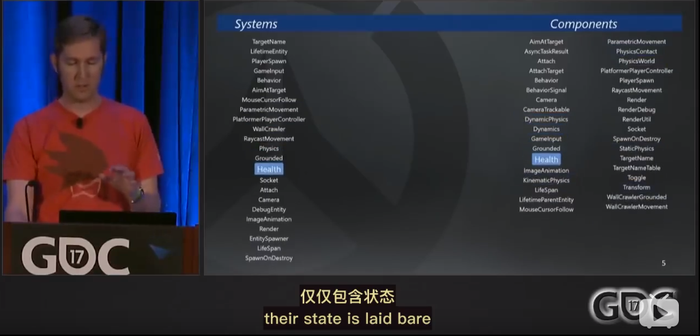

## 相关文档

[《守望先锋》架构设计与网络同步 -- GDC2017 精品分享实录]: https://gameinstitute.qq.com/community/detail/114516

[【译】GDC讲座系列之三 守望先锋的游戏架构和网络代码]: https://indienova.com/u/%25E9%259D%2592%25E9%2593%259C%25E7%259A%2584%25E5%25B9%25BB%25E6%2583%25B3/blogread/20619(https://indienova.com/u/%E9%9D%92%E9%93%9C%

[ECS Model 游戏开发架构浅析]: https://gameinstitute.qq.com/community/detail/124833

[游戏开发中的ECS 架构概述]: https://zhuanlan.zhihu.com/p/30538626

## ECS

## 网络

### 客户端领先服务器半个往返延迟

- 客户端时钟总是领先服务器半个往返延迟（half RTT）
- 再加一个缓冲的命令帧时间  one buffered command frame  (buffer)
- 在这里RTT基本上就是网络延迟，再加上处理时间。RTT == ping,  ping 加了服务器处理时间
- 当前例子 RTT差不多160毫秒， 他的一半就是80毫秒
- 再加上缓存命令帧的时间，就是16毫秒
- 那就是客户端领先服务器的时间

竖线代表的是命令帧执行的时间

客户端模拟会进行模拟，然后发出第15帧的输入消息

在一段段时间之后，这个时间是一半往返延迟时间加上缓存的时间，服务器会基于同样的输入进行模拟

下面左边人物操作这些服务器需要帮往返延迟才传给客户端的操作

- 如果客户端计算的结果和服务器一致，那么客户端就可以继续开心的模拟下一帧输入
- 如果客户端和服务器的结果不一致，那说明我们的预测错误，需要进行调解

- 一个最简单的办法就是用服务器端的结果覆盖客户端的结果

- 但这些结果是过去的，在服务器上一百多毫秒之前的结果

- 所以我们不仅保存了运动状态的环状缓存，同时也保存了输入的环状缓存

  

- 如果你现在有一个起始运动状态，然后用输入去模拟运行，那么每一次你都会可靠得到相同的结果

- 所以，当我们从服务器检测到一个错误的预测时，我们会根据你历史输入重新模拟从出错的时间一直到现在的状态

- 在第17帧的时候，我们以为我们在奔跑
- 但是服务器发现我嗯被眩晕了
- 这时要做的事情是，当客户端收到描述这个运动状态的数据包时，基本上我们要把运动状态恢复到经服务器验证过的那个时间点。我们根据输入，重新模拟制定现在的时间

- 通信用的是可靠UDP
- 当网络非常不稳定的时候，会产生丢包
- 服务器会试图保存一小段未经模拟的输入缓存
- 但这段缓存必须尽量的小，这样才能让游戏的响应尽量的快
- 如果这一小段缓存时间结束以后仍难没有得到输入数据
- 服务器会进行猜猜，他会重复你的上一次输入
- 当真正的输入数据到达的时候，他会进行调解来保证你不会错过任何一次按键，但是会有错误预测，这是麻烦的地方

这里丢了一些数据包

- 服务单意识到了这一点，但是他没有输入数据来模拟这一帧，但是他能做的是重复上一帧的输入来模拟，希望不会出错

  

- 他会想客户端发回一个消息说“嗨，我没有收到输入，什么地方出错了”

- 在这种情况下，客户端会开始增加约定的时间，并且稍微加快模拟的速度

- 我们之前说过所有的模拟都是基于固定间隔的

- 那么如果固定间隔是16毫秒

- 客户端会装作固定间隔是15.2毫秒，因此他会模拟的很快

  

- 结果就是，对于服务器来说，会看到模拟的结果出现过快

- 借助于服务器会得到一个更大的输入缓存来处理，等待着弥补数据的丢失

- 这种技术在网络具有小幅度波动的丢包率以及小幅度的延迟时，运行的很好

- 一旦服务器意识到你已经恢复正常以后

- 他会向你发送消息说， “嗨，知道吗？现在已经好了”

- 客户端会做和刚才相反的事，他会向另一个方向调整时间

  

- 这样的反馈循环会持续进行
- 他的目标是让你始终保持临界状态
- 但与此同时试图最小化复制输入造成的预测错误

- 之前提到过，当服务器缺乏玩家输入的时候，就会去复制之前的输入

- 一旦客户端赶上来的时候，这些被跳过的输入就会有丢失的危险

- 为了解决这个问题，客户端始终都会发出在某个时间窗口内的所有输入

  

- 所以我们不仅仅只发生我么正在模拟的这一帧
- 我们会发生自从上一个已经得到服务器验证的所有运动状态之后的所有输入

- 其实我们可以像预测移动一样预测你放的每一个技能，但是实际上我们选择不去预测技能
- 同样也选择不去预测武器和其他东西

### 击中判定的预测和确认 Hit Registration

- CombatUtil::IsHostitleTo  检测敌人是否被击中
- ModifyHealthQueue 修改生命值队列组件
- MovementState 

- 伤害判定都是在服务器中，因为客户端会作弊
- 击中判定会在客户端进行预测

- .如果你具有运动状态，那么服务器就又可能把你的位置回滚到某个玩家的参考帧
- 那就是在计算击中判定之前所需做的背后调解
- 这与你是否具有生命修改队列或者你能否受到伤害无关
- 我们需要对门、平台或者推车进行回滚，因为我们要查看子弹是否被他们挡住
- 很自然，如果你是对方同时又具有生命值修改队列
- 还有运动状态组件，那么你回被回滚是可能受到伤害
- 回滚是有一组辅助函数来处理的行为
- 而受到的伤害是有延迟的生命值修改队列组件所实现的另一个行为
- 我们依然把两者独立分开，回滚的行为是在它自己的部分运行，而造成伤害也是在自己的部分运行

- 我们现在看到的是没一个实体的一个包围框
- 这里的包围框是指在一段时间内，这个角色所能到达的范围
- 这个包围框显示的就是在最近半秒以内他的行为范围
- 如果我向准星射击，那么我在回滚他之前会先合这个包围框做碰撞检测
- 因为根据上图他会出现在包围框其中的任务地方
- 在现在的例子里，如果我们向这个方向射击，那我只需回滚安娜
- 因为我的子弹发出的射线会与他的包围框相交
- 我们不会去回滚哈特，或他的盾牌，或推车以及后面的门

- 射击可能出现错误预测，就像运动可能出现错误预测

- 如果你的延迟真的很高
- 那么击中预测就不再可靠了
- 一旦你的往返延时高于220毫秒，我们将会延迟一部分击中冲击特效，我们将不再对他们进行预测
- 我们会等着服务器来确认
- 我们为什么这么做，当你开始需要将目标回滚到很久以前的时候，我们将开始在客户端进行推测
- 我们不想让延迟的受害者感觉他们被回滚到一堵墙后面
- 所以我们设定了一个范围
- 所以我们只会为你回滚一定的时间，之后我们就开始进行推测

